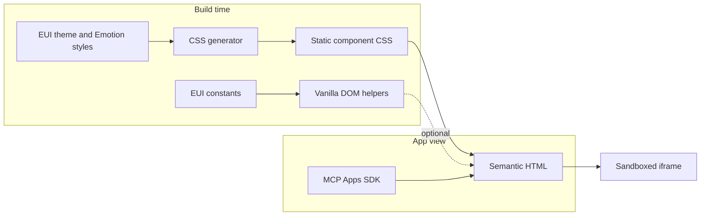

# @elastic/eui-vanilla

> [!WARNING]
> **Architectural spike**
>
> This package demonstrates one way to reuse EUI's Emotion styles without shipping React or Emotion but it is **not a recommended production architecture**.

Lightweight EUI styles and DOM helpers without React or Emotion at runtime.

This package is for small, isolated documents such as [MCP Apps](https://modelcontextprotocol.io/docs/extensions/apps). It supports simple UI primitives. Complex components such as `EuiDataGrid` and `EuiComboBox` remain part of `@elastic/eui`.

## How it works

EUI's existing theme and Emotion style functions generate static CSS at build time. React and Emotion are build-time tools only. The browser receives CSS and, when needed, small dependency-free JavaScript helpers.

### Architecture




The CSS generator is the only layer that reads EUI style functions. DOM helpers may share dependency-free EUI constants but never import React, Emotion or component style modules. The app remains responsible for layout, state and host communication.

The smallest option is semantic HTML with EUI Vanilla CSS:

```html
<html data-theme="light">
  <head>
    <link rel="stylesheet" href="@elastic/eui-vanilla/base.css" />
    <link rel="stylesheet" href="@elastic/eui-vanilla/button.css" />
  </head>
  <body>
    <button
      class="euiButton euiButton--primary euiButton--m euiButton--fill"
      type="button"
    >
      <span class="euiButton__content">
        <span class="eui-textTruncate">Deploy</span>
      </span>
    </button>
  </body>
</html>
```

Set `data-theme` to `light` or `dark` on `<html>` and set the matching CSS `color-scheme`.

## Dynamic views

Use a helper when JavaScript needs to create or update a primitive:

```ts
import { mountButton } from '@elastic/eui-vanilla';

const button = mountButton(document.getElementById('button')!, {
  label: 'Deploy',
  color: 'primary',
  fill: true,
  onClick: deploy,
});

button.update({ isLoading: true });
button.destroy();
```

Helpers own only the element mounted in their container. Your view owns page layout, state and application lifecycle.

## MCP Apps

This package is a UI layer, not an MCP App or transport library. Use [`@modelcontextprotocol/ext-apps`](https://github.com/modelcontextprotocol/ext-apps) to connect the view, receive tool results and communicate with the host.

Apply the host theme when the app connects and whenever it changes:

```ts
import { App, applyDocumentTheme } from '@modelcontextprotocol/ext-apps';

const app = new App({ name: 'deploy-view', version: '1.0.0' });

app.onhostcontextchanged = ({ theme }) => {
  if (theme) applyDocumentTheme(theme);
};

await app.connect();

const theme = app.getHostContext()?.theme;
if (theme) applyDocumentTheme(theme);
```

Register the complete bundled view as the `ui://` resource:

```ts
registerAppTool(
  server,
  'deploy',
  { _meta: { ui: { resourceUri } } },
  handler
);

registerAppResource(
  server,
  resourceUri,
  resourceUri,
  { mimeType: RESOURCE_MIME_TYPE },
  async () => ({
    contents: [
      { uri: resourceUri, mimeType: RESOURCE_MIME_TYPE, text: viewHtml },
    ],
  })
);
```

## Spike assessment

### Advantages

- The browser receives only static CSS and small dependency-free helpers.
- Generated styles closely match EUI component recipes.
- Existing EUI theme values, style declarations and constants can be reused.
- EUI style changes can often be adopted by regenerating CSS.

### Downsides

- It imports private EUI internals that are not stable public APIs.
- Its build depends on EUI's React, Emotion and theme implementation.
- It requires custom Emotion serialization and CSS-generation infrastructure.
- Markup, behavior and accessibility still need manually maintained vanilla adapters.
- Internal EUI refactors can break the build even when the resulting design is unchanged.

### Conclusion

For the intended simple components — buttons, badges, callouts and native form controls — a completely detached vanilla HTML library is the better architecture. It should own small handwritten CSS recipes and dependency-free behavior while consuming the [`@elastic/design-tokens` source proposed in #9595](https://github.com/elastic/eui/pull/9595). EUI should remain the visual and accessibility reference, with parity protected by tests and visual regression coverage.

React-heavy composites such as `EuiComboBox` and `EuiDataGrid` remain out of scope because most of their value is behavior and state rather than reusable styling.

## Development

```bash
yarn workspace @elastic/eui-vanilla generate
yarn workspace @elastic/eui-vanilla test
yarn workspace @elastic/eui-vanilla storybook
yarn workspace @elastic/eui-vanilla bench
```

Generated CSS lives in `generated/`. Do not edit it directly.

See [CONTRIBUTE.md](./CONTRIBUTE.md) for the component workflow and [BENCHMARK.md](./BENCHMARK.md) for current size measurements.