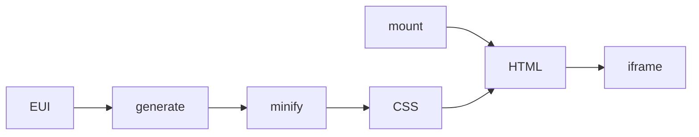

# @elastic/eui-vanilla

Vanilla EUI primitives (HTML/CSS/JS, no React) for iframe hosts such as [MCP Apps](https://modelcontextprotocol.io/docs/extensions/apps). Button, badge, simple controls - not DataGrid.

Component CSS is **generated** from EUI's existing Emotion style functions at build time. See [CONTRIBUTE.md](./CONTRIBUTE.md) to add a component.

## Why

MCP Apps load a `ui://` HTML resource into a sandboxed iframe (`text/html;profile=mcp-app`). Full `@elastic/eui` works there but it pulls React, Emotion and `EuiProvider`. This package is the lightweight UI kit for that iframe: generated CSS plus `mount`. It is not an MCP App by itself.

This package owns interactive HTML fragments. The **view** (your document) owns host talk: MCP Apps `App` SDK (`ui/initialize`, tool input/result). Do not treat one component as the `ui://` resource.

## Architecture



Emotion and React stop at **generate**. Runtime is CSS + `mount`. You put both into **your** HTML, then register that file as the MCP App resource.

## EUI vs Vanilla

| | `@elastic/eui` | `@elastic/eui-vanilla` |
| --- | --- | --- |
| Runtime | React, Emotion, `EuiProvider` | CSS + JS mount |
| Styles | Emotion at runtime | Generated CSS |
| Host | React apps | iframes (e.g. MCP Apps) |

## Usage

Compose primitives in **your** MCP App view. The host fetches that HTML via `ui://` and renders the iframe. Wire the view with [`@modelcontextprotocol/ext-apps`](https://github.com/modelcontextprotocol/ext-apps) (`App.connect()`), not with this package.

```ts
import { App } from '@modelcontextprotocol/ext-apps';
import { mountButton } from '@elastic/eui-vanilla';

const app = new App({ name: 'deploy-view', version: '1.0.0' });
const root = document.getElementById('root')!;

app.ontoolresult = () => {
  mountButton(root, {
    label: 'Deploy',
    color: 'primary',
    fill: true,
    onClick: () => {
      void app.sendMessage({
        role: 'user',
        content: [{ type: 'text', text: 'Deploy clicked' }],
      });
    },
  });
};

await app.connect();
```

In the document:

1. Load CSS: `@elastic/eui-vanilla/base.css` + `@elastic/eui-vanilla/button.css` (and any other ids you mount).
2. Set `data-color-mode="LIGHT"` or `"DARK"` on `<html>`. Map host theme here if the SDK exposes it.
3. Mount into a container you own. Call several `mount*` fns for a real widget (form, callout + button, …).

On the server, register **that view HTML** (your bundle), not a per-component file:

```ts
registerAppTool(server, 'deploy', { _meta: { ui: { resourceUri } }, /* … */ }, handler);
registerAppResource(server, resourceUri, resourceUri, { mimeType: RESOURCE_MIME_TYPE }, async () => ({
  contents: [{ uri: resourceUri, mimeType: RESOURCE_MIME_TYPE, text: viewHtml }],
}));
```

`postToHost(method, params)` is a tiny raw `postMessage` helper (no-op when not embedded). Prefer the MCP Apps SDK in a real view. Storybook logs it in **Actions**.

## Scripts

```bash
yarn workspace @elastic/eui-vanilla generate    # CSS
yarn workspace @elastic/eui-vanilla storybook   # http://localhost:4173
yarn workspace @elastic/eui-vanilla test
```

## Reused vs hand-written

| From EUI | From scratch |
| --- | --- |
| Emotion style fns → CSS | `mount` DOM |
| Theme tokens | Behavior that isn't CSS |
| Shared consts (color, size, display) | Stable class names (no hashes) |

Re-run `yarn generate` after EUI style changes. Don't edit generated CSS.
