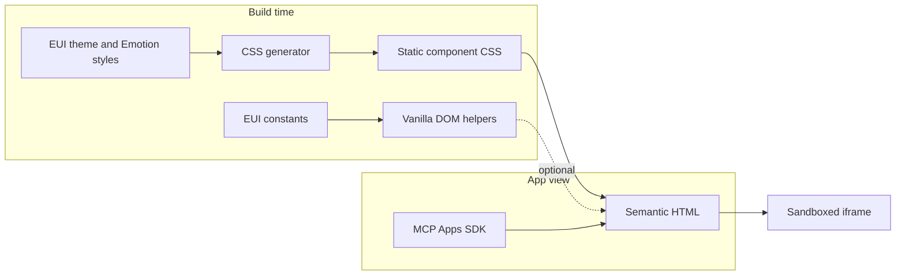

# @elastic/eui-vanilla

Lightweight EUI styles and DOM helpers without React or Emotion at runtime.

This package is for small, isolated documents such as [MCP Apps](https://modelcontextprotocol.io/docs/extensions/apps). It supports simple UI primitives. Complex components such as `EuiDataGrid` and `EuiComboBox` remain part of `@elastic/eui`.

## How it works

EUI's existing theme and Emotion style functions generate static CSS at build time. React and Emotion are build-time tools only. The browser receives CSS and, when needed, small dependency-free JavaScript helpers.

### Architecture




The CSS generator is the only layer that reads EUI style functions. DOM helpers may share dependency-free EUI constants but never import React, Emotion or component style modules. The app remains responsible for layout, state and host communication.

The smallest option is semantic HTML with EUI Vanilla CSS:

```html
<html data-color-mode="LIGHT">
  <head>
    <link rel="stylesheet" href="@elastic/eui-vanilla/base.css" />
    <link rel="stylesheet" href="@elastic/eui-vanilla/button.css" />
  </head>
  <body>
    <button
      class="euiButton euiButton--primary euiButton--m euiButton--fill"
      type="button"
    >
      <span class="euiButton__content">
        <span class="eui-textTruncate">Deploy</span>
      </span>
    </button>
  </body>
</html>
```

Set `data-color-mode` to `LIGHT` or `DARK` on `<html>`.

## Dynamic views

Use a helper when JavaScript needs to create or update a primitive:

```ts
import { mountButton } from '@elastic/eui-vanilla';

const button = mountButton(document.getElementById('button')!, {
  label: 'Deploy',
  color: 'primary',
  fill: true,
  onClick: deploy,
});

button.update({ isLoading: true });
button.destroy();
```

Helpers own only the element mounted in their container. Your view owns page layout, state and application lifecycle.

## MCP Apps

This package is a UI layer, not an MCP App or transport library. Use [`@modelcontextprotocol/ext-apps`](https://github.com/modelcontextprotocol/ext-apps) to connect the view, receive tool results and communicate with the host.

Register the complete bundled view as the `ui://` resource:

```ts
registerAppTool(
  server,
  'deploy',
  { _meta: { ui: { resourceUri } } },
  handler
);

registerAppResource(
  server,
  resourceUri,
  resourceUri,
  { mimeType: RESOURCE_MIME_TYPE },
  async () => ({
    contents: [
      { uri: resourceUri, mimeType: RESOURCE_MIME_TYPE, text: viewHtml },
    ],
  })
);
```

## Reuse and limitations

**EUI Vanilla** reuses:

- Theme tokens, including colors, spacing, typography and radii.
- Static style declarations generated from EUI style functions.
- Dependency-free constants and functions where practical.

It cannot directly reuse:

- React markup, lifecycle, state or context.
- Component behavior and accessibility hooks.
- Runtime Emotion style composition.

Token changes and edits to existing EUI style declarations usually require only regenerating the CSS. New style keys, selectors, markup, behavior and accessibility changes must also be reflected in the vanilla adapter and its tests.

This model works well for presentational primitives such as buttons, badges, callouts and native form controls. React-heavy composites such as `EuiComboBox` and `EuiDataGrid` are intentionally out of scope: most of their value is behavior and state rather than reusable styling.

## Development

```bash
yarn workspace @elastic/eui-vanilla generate
yarn workspace @elastic/eui-vanilla test
yarn workspace @elastic/eui-vanilla storybook
yarn workspace @elastic/eui-vanilla bench
```

Generated CSS lives in `generated/`. Do not edit it directly.

See [CONTRIBUTE.md](./CONTRIBUTE.md) for the component workflow and [BENCHMARK.md](./BENCHMARK.md) for current size measurements.