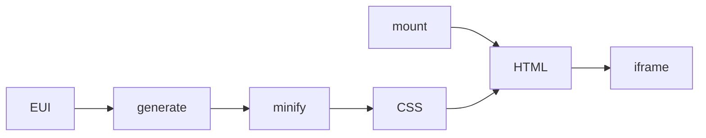

# @elastic/eui-vanilla

Vanilla EUI primitives (HTML/CSS/JS, no React) for iframe hosts such as [MCP Apps](https://modelcontextprotocol.io/docs/extensions/apps).

Component CSS is **generated** from EUI's existing Emotion style functions at build time.

## Why

MCP Apps load a `ui://` HTML resource into a sandboxed iframe (`text/html;profile=mcp-app`). Full `@elastic/eui` works there but it pulls React, Emotion and `EuiProvider`. This package ships one self-contained HTML file per view.

This package owns interactive HTML. Consumers own `postMessage` / MCP Apps `App` SDK.

## Architecture



Emotion and React stop at **generate**. Runtime is CSS + `mount`.

## EUI vs Vanilla

| | `@elastic/eui` | `@elastic/eui-vanilla` |
| --- | --- | --- |
| Runtime | React, Emotion, `EuiProvider` | CSS + JS mount |
| Styles | Emotion at runtime | Generated CSS |
| Host | React apps | iframes (e.g. MCP Apps) |

## Usage

```ts
import { mountButton } from '@elastic/eui-vanilla';

mountButton(document.getElementById('root')!, {
  label: 'Deploy',
  color: 'primary',
  fill: true,
  onClick: () => {},
});
```

CSS: `generated/button.css` (set `data-color-mode="LIGHT"` or `"DARK"` on `<html>`).

MCP resource: `dist/button.html` - single file, CSS + JS inlined.

## Scripts

```bash
yarn workspace @elastic/eui-vanilla build     # serialize EUI styles, minify, dist/button.html
yarn workspace @elastic/eui-vanilla harness   # http://localhost:4173
yarn workspace @elastic/eui-vanilla test
```

## Reused vs hand-written

| From EUI | From scratch |
| --- | --- |
| Emotion style fns → CSS | `mount` DOM |
| Theme tokens | Behavior that isn't CSS |
| Shared consts (color, size, display) | Stable class names (no hashes) |

Re-run `yarn generate` after EUI style changes. Don't edit generated CSS.
