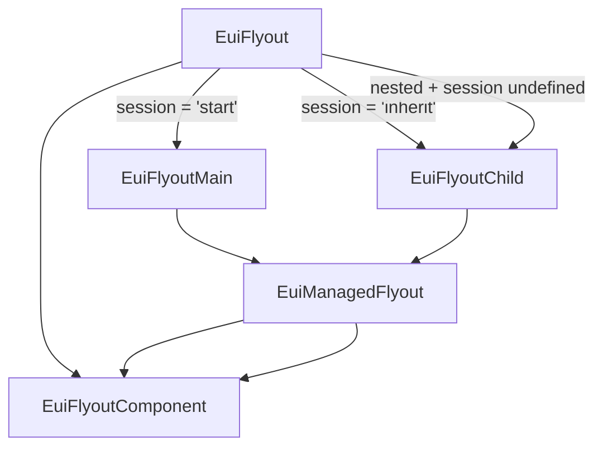

# EuiFlyout

[Documentation - production](https://eui.elastic.co/docs/components/containers/flyout/)

[Documentation - local](http://localhost:3000/docs/components/containers/flyout/)

[Documentation - sources](../../../../website/docs/components/containers/flyout)

## Component composition

The core implementation of EuiFlyout lives in the internal [EuiFlyoutComponent](./flyout.component.tsx) file.
It contains the main logic and UI for rendering flyouts. However, it's not the component
that EUI consumers interact with directly.

The EuiFlyout export actually comes from [`flyout.tsx`](./flyout.tsx) which is a thin logical
wrapper that conditionally routes to different implementations:
- `session="start"` → [EuiFlyoutMain](./manager/flyout_main.tsx) (creates new session)
- `session="inherit"` → [EuiFlyoutChild](./manager/flyout_child.tsx) (joins existing session)
- `session="never"` → [EuiFlyoutComponent](./flyout.component.tsx) (standard flyout)
- `session` undefined + nested inside parent → [EuiFlyoutChild](./manager/flyout_child.tsx) (auto-inherits)
- `session` undefined + not nested → [EuiFlyoutComponent](./flyout.component.tsx) (standard flyout)

This structure provides better business logic separation and enables intuitive nested flyout behavior.

## Resizable flyouts

Historically, the resizable variant of EuiFlyout was a separate component called
[EuiFlyoutResizable](./flyout_resizable.tsx). It was a wrapper over the regular `EuiFlyout` that injected
additional event handlers and a drag handler element to flyout's `children`.

Currently, this logic is moved to an internal [`useEuiFlyoutResizable`](./use_flyout_resizable.ts) hook
that serves the same purpose, but is directly integrated into EuiFlyoutComponent,
and the resizability feature is enabled via the `resizable` prop for simplicity and ability
to dynamically change whether the flyout is resizable or not.

The EuiFlyoutResizable component still exists as a thin wrapper over EuiFlyout
that sets the `resizable` prop to `true`, and is exported as part of the public API
for backwards compatibility.

## Managed flyouts (aka flyout session management)

The developer README for the managed flyouts lives in the [`manager` subdirectory](./manager/README.md).
