```mdx-code-block
import { EuiFlexGroup, EuiFlexItem, EuiButton, EuiButtonEmpty, EuiButtonIcon, EuiIcon, EuiTable, EuiTableBody, EuiTableHeader, EuiTableHeaderCell, EuiTableRow, EuiTableRowCell } from '@elastic/eui';
```

# Button

Buttons enable **user actions** and are crucial for forms, modals, toolbars, and interactive pages. These guidelines detail their optimal configuration and placement.

Buttons offer various types, sizes, colors, and properties. The best combination depends on placement, prominence, and state. `EuiButton` is for primary and secondary actions, while `EuiButtonEmpty` is for tertiary or low-prominence actions.

## Button types

### Regular

Regular `EuiButton` can be used for two types of actions: primary and secondary. It has the `fill` property set to `false` by default, which is typically used for **secondary actions**, striking a balance between visibility and visual noise. They are less prominent than primary actions and can be used alongside them. **Primary actions (CTAs)** should be represented by filled buttons (`fill: true`).

```tsx interactive
import React, { useState } from 'react';
import {
  EuiButton,
  EuiFlexGroup,
  EuiFlexItem,
  EuiSpacer,
  EuiSelect,
  EuiSwitch,
} from '@elastic/eui';
import { COLORS } from '@elastic/eui/es/components/button/button';

export default () => {
  const [disableButton, setDisableButton] = useState(false);
  const [fillButton, setFillButton] = useState(false);
  const [fullButton, setFullButton] = useState(false);
  const [smallButton, setSmallButton] = useState(false);
  const [withIconButton, setWithIconButton] = useState(false);

  // While `accentSecondary` is currently available on the component, it is likely to be removed
  // `neutral` and `risk` are only tentatively added but might be removed
  const filteredColors = COLORS.filter((name) => !['accentSecondary', 'neutral', 'risk'].includes(name));
  const buttonColorsOptions = filteredColors.map((name) => {
    return {
      value: name,
      text: name,
    };
  });

  const [buttonColor, setButtonColor] = useState(buttonColorsOptions[2].value);

  const onChangeButtonColor = (e) => {
    setButtonColor(e.target.value);
  };

  return(
    <div>
    <EuiFlexGroup
        gutterSize="m"
        alignItems="center"
        wrap={true}
      >
        <EuiFlexItem grow={false}>
          <EuiSelect
            prepend="Color"
            options={buttonColorsOptions}
            value={buttonColor}
            onChange={(e) => onChangeButtonColor(e)}
            compressed
            aria-label="Button colors"
          />
        </EuiFlexItem>
        <EuiFlexItem grow={false}>
          <EuiSwitch
            compressed
            label="Fill"
            checked={fillButton}
            onChange={() => setFillButton(!fillButton)}
          />
        </EuiFlexItem>
        <EuiFlexItem grow={false}>
          <EuiSwitch
            compressed
            label="Full width"
            checked={fullButton}
            onChange={() => setFullButton(!fullButton)}
          />
        </EuiFlexItem>
        <EuiFlexItem grow={false}>
          <EuiSwitch
            compressed
            label="Small"
            checked={smallButton}
            onChange={() => setSmallButton(!smallButton)}
          />
        </EuiFlexItem>
        <EuiFlexItem grow={false}>
          <EuiSwitch
            compressed
            label="With icon"
            checked={withIconButton}
            onChange={() => setWithIconButton(!withIconButton)}
          />
        </EuiFlexItem>
        <EuiFlexItem grow={false}>
          <EuiSwitch
            compressed
            label="Disabled"
            checked={disableButton}
            onChange={() => setDisableButton(!disableButton)}
          />
        </EuiFlexItem>
      </EuiFlexGroup>
      <EuiSpacer />
      <EuiButton
        color={buttonColor}
        disabled={disableButton}
        fill={fillButton}
        fullWidth={fullButton}
        size={smallButton ? 's' : 'm'}
        iconType={withIconButton ? 'discoverApp' : null}
        onClick={() => {}}
      >
        {!withIconButton ? 'Button' : 'Open in Discover'}
      </EuiButton>
    </div>
  );
};
```

### Empty

Empty buttons are for **complementary (tertiary)** actions like close, cancel, filter, and refresh, which typically affect data presentation rather than modification. They reduce a button's visual importance and support `xs` [size](#size) and the [flush](#flush-prop) property for alignment.

```tsx interactive
import React from 'react';

import {
  EuiButtonEmpty,
  EuiFlexGroup,
  EuiFlexItem,
} from '@elastic/eui';

export default () => (
  <EuiFlexGroup
    wrap={true}
    gutterSize="s"
    alignItems="center"
  >
    <EuiFlexItem grow={false}>
      <EuiButtonEmpty
        onClick={() => {}}
      >
        Empty button
      </EuiButtonEmpty>
    </EuiFlexItem>

    <EuiFlexItem grow={false}>
      <EuiButtonEmpty
        size="s"
        onClick={() => {}}
      >
        Small empty button
      </EuiButtonEmpty>
    </EuiFlexItem>

    <EuiFlexItem grow={false}>
      <EuiButtonEmpty
        size="xs"
        onClick={() => {}}
      >
        Extra small empty button
      </EuiButtonEmpty>
    </EuiFlexItem>
  </EuiFlexGroup>
);
```

### Icon

`EuiButtonIcon` is an **icon-only button**. Use `display` and `size` props to match standard buttons. The default appearance is `xs`, `empty`. Use only for common, intuitive actions with **immediately understood icons** (e.g., trash can for delete). `aria-label` is required for accessibility. Icon color inherits from the button's color property. Icon color is inherited from the button color property and, therefore, does not need to be set separately.

```tsx interactive
import React, { useState } from 'react';

import {
  EuiButtonIcon,
  EuiFlexGroup,
  EuiFlexItem,
  EuiSelect,
  EuiSpacer,
  EuiSwitch,
} from '@elastic/eui';
import { COLORS } from '@elastic/eui/es/components/button/button';

const DISPLAY_TYPES = ['empty', 'base', 'fill'];
const DISPLAY_SIZES = ['xs', 's', 'm'];
const ICON_SIZES = ['s', 'm', 'l', 'xl', 'xxl', 'original'];
// While `accentSecondary` is currently available on the component, it is likely to be removed
const filteredColors = COLORS.filter((name) => name !== 'accentSecondary');

export default () => {
  const buttonColorsOptions = filteredColors.map((name) => {
    return {
      value: name,
      text: name,
    };
  });
  const displayTypeOptions = DISPLAY_TYPES.map((name) => {
    return {
      value: name,
      text: name,
    };
  });
  const displaySizeOptions = DISPLAY_SIZES.map((name) => {
    return {
      value: name,
      text: name,
    };
  });
  const iconSizeOptions = ICON_SIZES.map((name) => {
    return {
      value: name,
      text: name,
    };
  });
  const [disableButton, setDisableButton] = useState(false);
  const [displayType, setDisplayType] = useState(displayTypeOptions[0].value);
  const [displaySize, setDisplaySize] = useState(displaySizeOptions[0].value);
  const [iconSize, setIconSize] = useState(iconSizeOptions[1].value);
  const [buttonColor, setButtonColor] = useState(buttonColorsOptions[2].value);

  const onChangeDisplayType = (e) => {
    setDisplayType(e.target.value);
  };

  const onChangeDisplaySize = (e) => {
    setDisplaySize(e.target.value);
  };

  const onChangeIconSize = (e) => {
    setIconSize(e.target.value);
  };

  const onChangeButtonColor = (e) => {
    setButtonColor(e.target.value);
  };

  return(
    <>
      <EuiFlexGroup
        gutterSize="m"
        alignItems="center"
        wrap={true}
      >
        <EuiFlexItem grow={false}>
          <EuiSelect
            prepend="Color"
            options={buttonColorsOptions}
            value={buttonColor}
            onChange={(e) => onChangeButtonColor(e)}
            compressed
            aria-label="Button colors"
          />
        </EuiFlexItem>
        <EuiFlexItem grow={false}>
          <EuiSelect
            prepend="Display"
            options={displayTypeOptions}
            value={displayType}
            onChange={(e) => onChangeDisplayType(e)}
            compressed
            aria-label="Button display styles"
          />
        </EuiFlexItem>
        <EuiFlexItem grow={false}>
          <EuiSelect
            prepend="Size"
            options={displaySizeOptions}
            value={displaySize}
            onChange={(e) => onChangeDisplaySize(e)}
            compressed
            aria-label="Button sizes"
          />
        </EuiFlexItem>
        <EuiFlexItem grow={false}>
          <EuiSelect
            prepend="Icon size"
            options={iconSizeOptions}
            value={iconSize}
            onChange={(e) => onChangeIconSize(e)}
            compressed
            aria-label="Icon in button sizes"
          />
        </EuiFlexItem>
        <EuiFlexItem grow={false}>
          <EuiSwitch
            compressed
            label="Disabled"
            checked={disableButton}
            onChange={() => setDisableButton(!disableButton)}
          />
        </EuiFlexItem>
      </EuiFlexGroup>
      <EuiSpacer size="xl" />
      <EuiButtonIcon
        color={buttonColor}
        display={displayType}
        size={displaySize}
        iconSize={iconSize}
        disabled={disableButton}
        onClick={() => {}}
        iconType="documentation"
        aria-label="Open documentation"
      />
    </>
  );
};
```

```tsx interactive
import React, { useState } from 'react';

import {
  EuiButtonIcon,
  EuiFlexGroup,
  EuiFlexItem,
} from '@elastic/eui';

export default () => (
  <EuiFlexGroup responsive={false} gutterSize="s" alignItems="flexStart">
    <EuiFlexItem grow={false}>
      <EuiButtonIcon display="base" iconType="lensApp" size="m" aria-label="Lens" />
    </EuiFlexItem>
    <EuiFlexItem grow={false}>
      <EuiButtonIcon display="base" iconType="warning" size="s" color="warning" aria-label="Warning" />
    </EuiFlexItem>
    <EuiFlexItem grow={false}>
      <EuiButtonIcon
        iconType="dashboardApp"
        aria-label="Dashboard"
        color="text"
      />
    </EuiFlexItem>
    <EuiFlexItem grow={false}>
      <EuiButtonIcon
        iconType="trash"
        aria-label="Delete"
        color="danger"
      />
    </EuiFlexItem>
  </EuiFlexGroup>
);
```

:::accessibility Accessibility
`EuiButtonIcon` requires an `aria-label` to express the meaning to screen readers.
:::

<EuiFlexGroup gutterSize="m">
  <Guideline type="do" text="Use icon buttons for universal actions that are easy to understand.">
    <EuiButtonIcon size="m" iconType="pencil" aria-label="Edit" />&nbsp;&nbsp;<EuiButtonIcon size="m" iconType="expand" aria-label="Expand" />
  </Guideline>
  <Guideline type="dont" text="Icons alone in a standard button look awkward and take too much space.">
    <EuiButton><EuiIcon type="pencil" aria-label="Edit" /></EuiButton>&nbsp;&nbsp;<EuiButton><EuiIcon type="expand" aria-label="Expand" /></EuiButton>
  </Guideline>
</EuiFlexGroup>

### Button as link

Use `EuiButton` for actions and `EuiLink` for text-based navigation. Buttons and links have different semantic and technical implications. Buttons accept `href` (renders as `<a>`) or `onClick` (renders as `<button>`). Using both simultaneously is generally not recommended.
If you are creating a purely text-based link, like the one in the previous paragraph, use `EuiLink` instead.

```tsx interactive
import React, { Fragment } from 'react';

import {
  EuiButton,
  EuiButtonEmpty,
  EuiButtonIcon,
  EuiFlexGroup,
  EuiFlexItem,
  EuiSpacer,
} from '@elastic/eui';

export default () => (
  <Fragment>
    <EuiFlexGroup responsive={false} wrap gutterSize="s" alignItems="center">
      <EuiFlexItem grow={false}>
        <EuiButton href="#using-href-and-onclick">Button with href</EuiButton>
      </EuiFlexItem>

      <EuiFlexItem grow={false}>
        <EuiButtonEmpty href="#using-href-and-onclick">
          Empty button with href
        </EuiButtonEmpty>
      </EuiFlexItem>
    </EuiFlexGroup>
  </Fragment>
);
```

:::info Note
For more specific information on how to integrate EUI buttons with react-router, see this [wiki page](https://github.com/elastic/eui/blob/main/wiki/consuming-eui/react-router.md#how-react-router-works).
:::

## Style

:::warning Warning
Do not override button styles. EUI provides properties to manage color, size, and state to cover various use cases, ensuring consistent interactions.
:::

### Color and semantic

Buttons come in various colors, with `primary`, `text`, or `danger` being typical choices. `Primary` is the default.`Danger`, `warning`, and `success` buttons convey specific meanings:

- **Danger**: Negative, destructive action, critical attention.
- **Warning**: Caution, extra attention.
- **Success**: Positive, successfully-completed action, least attention.

```tsx interactive
import React, { useState } from 'react';

import {
  EuiButton,
  EuiFlexGroup,
  EuiFlexItem,
} from '@elastic/eui';

export default () => (
  <EuiFlexGroup responsive={false} gutterSize="s" alignItems="flexStart">
    <EuiFlexItem grow={false}>
      <EuiButton color="danger">Danger</EuiButton>
    </EuiFlexItem>
    <EuiFlexItem grow={false}>
      <EuiButton color="warning">Warning</EuiButton>
    </EuiFlexItem>
    <EuiFlexItem grow={false}>
      <EuiButton color="success">Success</EuiButton>
    </EuiFlexItem>
  </EuiFlexGroup>
);
```

**Avoid direct use** of semantic buttons unless they are part of existing EUI components. Direct use of `danger` (red) buttons is limited to confirming **destructive** outcomes, like deleting data, to maintain its elevated meaning.
`Success` (green) buttons indicate **unsaved or unprocessed** changes (draft or dirty state) to mitigate work loss. **Do not rely solely on color** for meaning; include a label or icon for accessibility and clarity.

### `Text` color variant

Use `text` button color variants on action-heavy UIs to reduce visual noise. This variant has a **unique bordered appearance** for dense screens with many inputs, buttons, and tabular content, where shaded buttons would create visual clutter. See more on how to combine button variants [below](#combining-button-variants).

```tsx interactive
import React, { useState } from 'react';

import {
  EuiButton,
  EuiButtonIcon
  EuiFlexGroup,
  EuiFlexItem,
} from '@elastic/eui';

export default () => (
  <EuiFlexGroup responsive={false} gutterSize="s" alignItems="flexStart">
    <EuiFlexItem grow={false}>
      <EuiButton color="text">Text color button</EuiButton>
    </EuiFlexItem>
    <EuiFlexItem grow={false}>
      <EuiButtonIcon color="text" display="base" iconType="pencil" size="m" aria-label="Edit" />
    </EuiFlexItem>
  </EuiFlexGroup>
);
```

### Size

Buttons default to a medium (`m`) size, suitable for most cases. Small (`s`) and extra small (`xs`) are also available. **Stick with the default size** unless necessary.
Extra small applies only to `EuiButtonEmpty` and `EuiButtonIcon`.

**Do not mix button sizes** within a group or row; maintain consistent height. Use `s` buttons in small containers, popovers, toasts, filter bars, and compressed forms **for constrained spaces**, not subjective design preferences. Use `xs` buttons for **supplementary information** alongside actions or within forms (see guidelines for writing help content). They are also used within other EUI components.

<EuiFlexGroup>
  <Guideline type="do" text="Stick to the default pattern: a filled, primary button paired with an empty, but same-colored button.">
    <EuiFlexGroup gutterSize="xs">
      <EuiFlexItem grow={false}>
        <EuiButton size="m">Button</EuiButton>
      </EuiFlexItem>
      <EuiFlexItem grow={false}>
        <EuiButtonIcon iconType="gear" color="primary" size="m" aria-label="Settings"/>
      </EuiFlexItem>
    </EuiFlexGroup>
  </Guideline>
  <Guideline type="dont" text="Readability suffers when multiple colors and sizes are used.">
    <EuiFlexGroup gutterSize="xs">
      <EuiFlexItem grow={false}>
        <EuiButton size="m">Button</EuiButton>
      </EuiFlexItem>
      <EuiFlexItem grow={false}>
        <EuiButtonIcon iconType="trash" color="danger" size="xs" aria-label="Delete"/>
      </EuiFlexItem>
    </EuiFlexGroup>
  </Guideline>
</EuiFlexGroup>

### Width

Button width is generally **determined by content** (label, icon, padding). [Icon-only buttons](#icon) are smaller and **square**. EUI sets a **default minimum width** for consistency, which should be overridden rarely. Use `fullWidth` buttons primarily in narrow forms or for mobile responsiveness; use sparingly in larger desktop viewports.

<EuiFlexGroup>
  <Guideline type="do" text="Use full-width buttons in narrow forms.">
    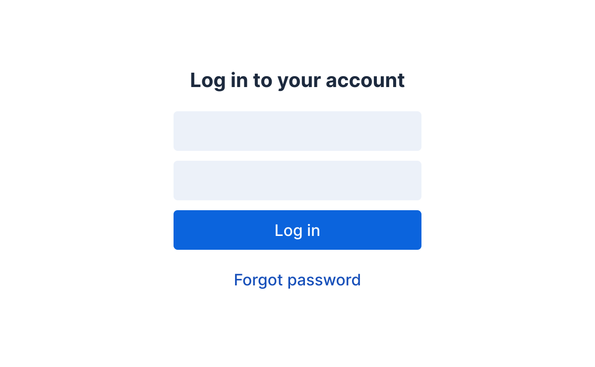
  </Guideline>
  <Guideline type="dont" text="Don't make buttons unnecessary wide in larger viewports.">
    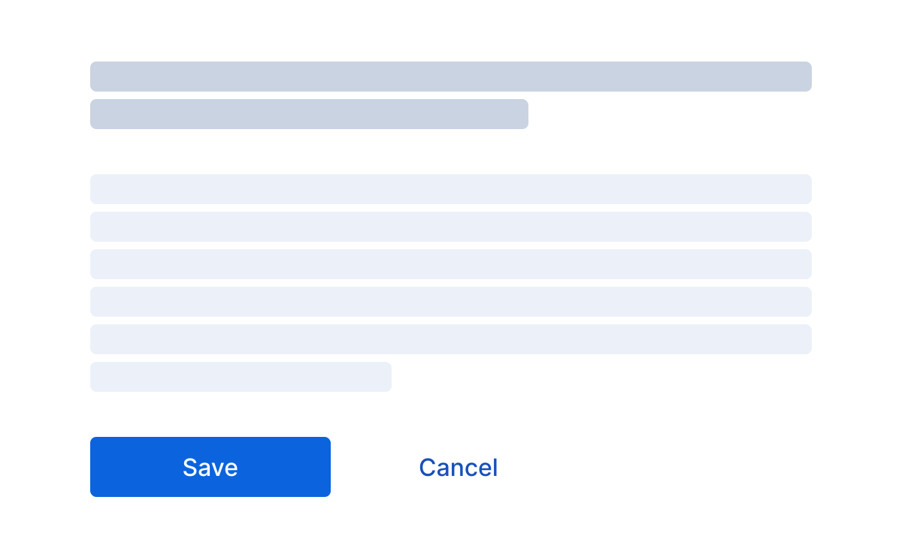
  </Guideline>
</EuiFlexGroup>

### `Flush` prop

The `flush` property is only available for `EuiButtonEmpty`. It removes padding, ensuring stricter alignment with surrounding content, especially at container edges where empty buttons might otherwise create a ragged line.

```tsx interactive
import React from 'react';

import {
  EuiButton,
  EuiButtonEmpty,
  EuiFlexGroup,
  EuiFlexItem,
  EuiHorizontalRule,
  EuiPanel,
  EuiTitle,
} from '@elastic/eui';

export default () => (
  <EuiFlexGroup gutterSize="s" direction="row">
    <EuiFlexItem css={{width: 240}} grow={false}>
      <EuiPanel color="plain" hasBorder>
        <EuiTitle size="xs"><h4>Title of panel</h4></EuiTitle>
        <EuiHorizontalRule />
        <EuiButtonEmpty flush="left">Flush left</EuiButtonEmpty>
      </EuiPanel>
    </EuiFlexItem>
    <EuiFlexItem css={{width: 240}} grow={false}>
      <EuiPanel css={{textAlign: "right"}} color="plain" hasBorder grow={false}>
        <EuiButton size="s">Button</EuiButton>
        <EuiHorizontalRule />
        <EuiButtonEmpty flush="right">Flush right</EuiButtonEmpty>
      </EuiPanel>
    </EuiFlexItem>
  </EuiFlexGroup>
);
```

## State

### Disabled

Show a button in a disabled state when the action **cannot be performed** due to permissions, licensing, or data issues (e.g., invalid input). Consider whether the user needs to know the button exists; showing it indicates potential actions, while hiding it may lead to unawareness. Only hide buttons when the action's potential is immaterial. Do not show disabled buttons if the user is unlikely to perform the action. All button types have the same disabled state.

```tsx interactive
import React, { useState } from 'react';
import {
  EuiButton,
  EuiSpacer,
  EuiSwitch,
} from '@elastic/eui';

export default () => {
  const [disableButton, setDisableButton] = useState(true);

  return(
    <>
      <EuiSwitch
        compressed
        label="Disabled"
        checked={disableButton}
        onChange={() => setDisableButton(!disableButton)}
      />
      <EuiSpacer />
      <EuiButton disabled={disableButton} fill>
        {!disableButton ? 'Button' : 'Disabled'}
      </EuiButton>
    </>
  );
};
```

### Loading

Always consider the button loading state due to potential **performance slowdowns**. Set `isLoading` to `true` to display a loading spinner. Not handling this state can lead to extra clicks and user frustration. Setting isLoading to true adds a spinner or swaps an existing icon for one, and disables the button. Renaming the button to "Loading…" is good practice. All button types have the same loading state.

```tsx interactive
import React, { useState } from 'react';

import {
  EuiButton,
  EuiSpacer,
  EuiSwitch,
} from '@elastic/eui';

export default () => {
  const [loadingButton, setLoadingButton] = useState(true);

  return(
    <>
      <EuiSwitch
        compressed
        label="Is loading"
        checked={loadingButton}
        onChange={() => setLoadingButton(!loadingButton)}
      />
      <EuiSpacer />
      <EuiButton isLoading={loadingButton} fill>
        {loadingButton ? 'Loading...' : 'Button'}
      </EuiButton>
    </>
  );
};
```
## Button labels

Button labels should **clearly indicate the action**, using action words and an object if context isn't clear (e.g., "Create dashboard"). Labels should **not exceed three words**; longer labels may be better as text links.

### Preferred words

* **Add X** — Establishes a new relationship (e.g., "Add visualization"). Always followed by an object. Opposite: Remove.  
* **Cancel** — Stops an action without saving. Never red; always an empty button.  
* **Create X** — Creates a new object (e.g., "Create pipeline"). Always followed by an object. Opposite: Delete.  
* **Delete N items** — Permanently deletes data. Opposite: Create. Not to be confused with Remove.  
* **Remove X** — Removes a relationship without permanently deleting data (e.g., "Remove visualization"). Opposite: Add.  
* **Save** / **Save and complete** — Carries out pending changes (e.g., "Save edits"). Can be green if final save action. Not to be confused with Add.

### Words to be avoided

* **New** — Use ‘Add’ or ‘Create’.  
* **Ok** — Use action-specific words.  
* **Yes / No** — Use words that clearly explain the action.

## Usage

### Additional icons

Icons can serve as an **addition to the text label** to emphasize actions, but should be used sparingly. Icons work best on labels for binary actions, such as "Create" and"'Delete", or final actions, such as "Save".

<EuiFlexGroup gutterSize="m">
  <Guideline type="do" text={` The arrow shows that there are more items to fill out, and the check icon indicates the final action.`}>
    <EuiButton iconType="arrowRight" iconSide="right" fill>Continue</EuiButton>&nbsp;&nbsp;<EuiButton iconType="check" color="success" fill>Save and complete</EuiButton>
  </Guideline>
  <Guideline type="dont" text="Unnecessary icon just distracts the user, especially it is on the right and is hard to interpret.">
    <EuiButton iconType="indexOpen" iconSide="right" fill>Create index pattern</EuiButton>
  </Guideline>
</EuiFlexGroup>

### Combining buttons

Primary and secondary actions typically use `filled` and `default` styles, respectively. Display **one primary action button per layout** to signal its importance. Not every page requires a primary action button. Use default buttons for **secondary visual prominence**, less prominent than primary CTAs, but still visually distinct. They can be used in layouts without a CTA.

<EuiFlexGroup>
  <Guideline type="do" text="Use only one filled button per layout — the one you want the user to eventually complete.">
    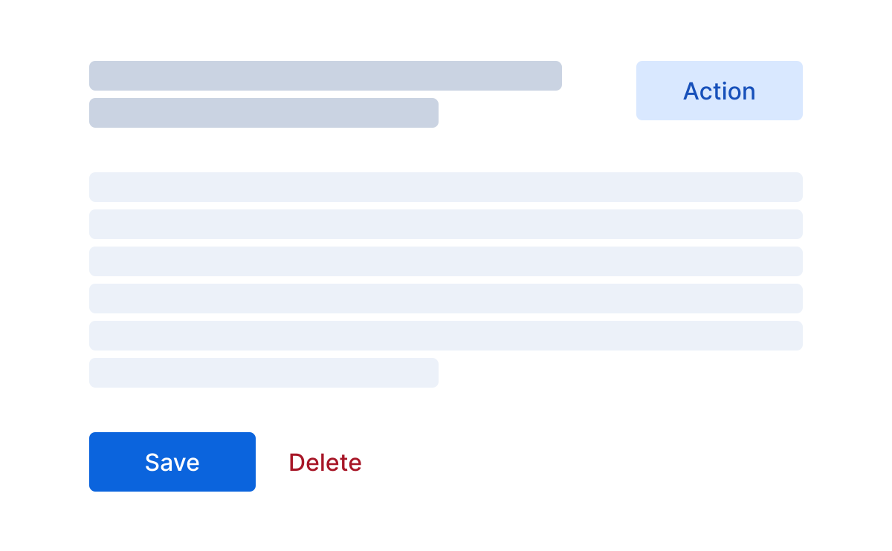
  </Guideline>
  <Guideline type="dont" text="Too many primary buttons will confuse the user.">
    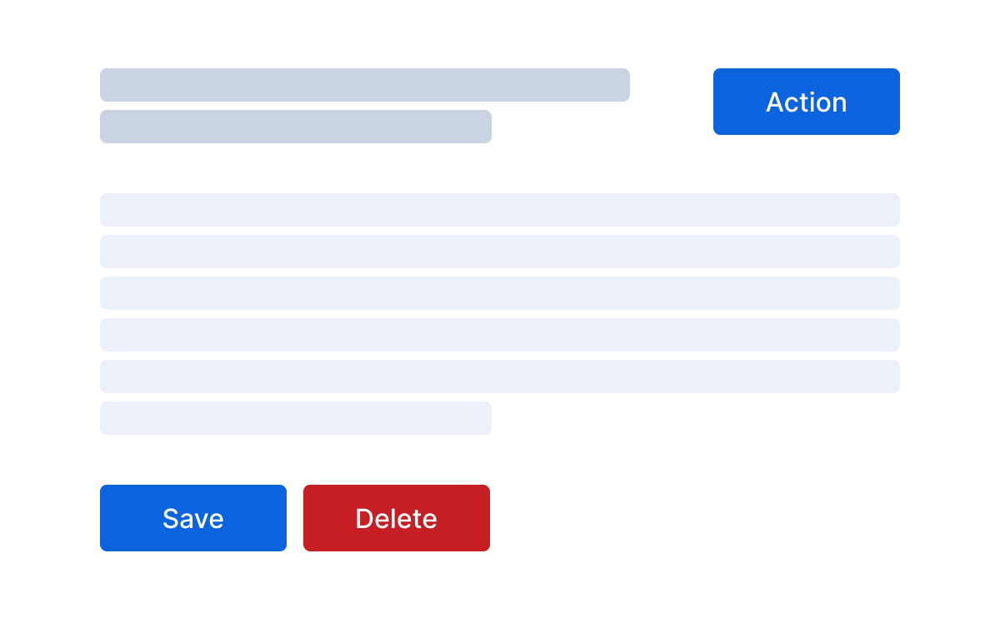
  </Guideline>
</EuiFlexGroup>

Buttons adjacent to a primary CTA should be **tertiary**, presented as **empty** buttons. Tertiary actions are less consequential, exiting the flow or not changing data.

**Do not use all three styles** in the same button group. When multiple actions are grouped, use either secondary (`default`) or tertiary (`EuiButtonEmpty`) styles. Avoid mixing simple/empty buttons with icon-only buttons in one row.

<EuiFlexGroup>
  <Guideline type="do" text="Stick to the default pattern: a filled, primary button paired with an empty, but same-colored button.">
    <EuiFlexGroup gutterSize="s">
      <EuiFlexItem grow={false}>
        <EuiButton fill>Save</EuiButton>
      </EuiFlexItem>
      <EuiFlexItem grow={false}>
        <EuiButtonEmpty>Cancel</EuiButtonEmpty>
      </EuiFlexItem>
    </EuiFlexGroup>
  </Guideline>
  <Guideline type="dont" text="Readability suffers when multiple colors and sizes are used.">
    <EuiFlexGroup gutterSize="s">
      <EuiFlexItem grow={false}>
        <EuiButton fill>Save</EuiButton>
      </EuiFlexItem>
      <EuiFlexItem grow={false}>
        <EuiButton>Cancel</EuiButton>
      </EuiFlexItem>
      <EuiFlexItem grow={false}>
        <EuiButton color="danger" size="s" fill>Delete</EuiButton>
      </EuiFlexItem>
    </EuiFlexGroup>
  </Guideline>
</EuiFlexGroup>

Use `text` color for buttons on **visually dense** screens. This reduces visual noise and emphasizes key actions, especially when primary or secondary CTAs are present.

<Guideline type="do" text="Use text buttons to reduce visual noise on dense screens with multiple actions.">
  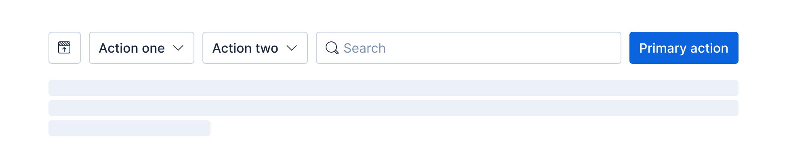
</Guideline>

### Placement and order

Place buttons **on the right** in restricted-width containers (modals, popovers, bottom bars, flyouts). The user path is left-to-right, top-to-bottom, in a Z-shaped pattern. Place primary actions on the bottom right, where users finish scanning.

<EuiFlexGroup gutterSize="m">
  <Guideline type="do" text="Place the primary action on the bottom right with the secondary action on its left in modals.">
    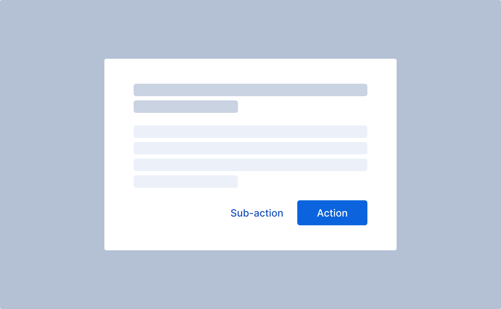
  </Guideline>
  <Guideline type="do" text="Always use buttons positioned to the right in popovers.">
    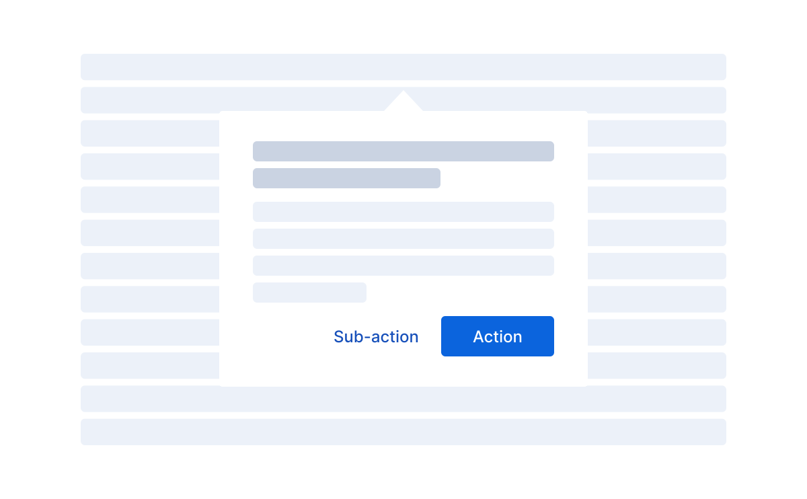
  </Guideline>
</EuiFlexGroup>

Place buttons **on the left** in unrestricted large-width spaces (page forms). Content is typically anchored left, with a top-to-bottom, F-shaped scanning pattern. Place primary actions on the bottom left, where users finish scanning. In left-aligned layouts, the **primary button** is the leftmost. In right-aligned layouts, it is the rightmost.

<EuiFlexGroup gutterSize="m">
  <Guideline type="do" text="Put the primary action in the leftmost position so the user's eye never has to leave the one side.">
    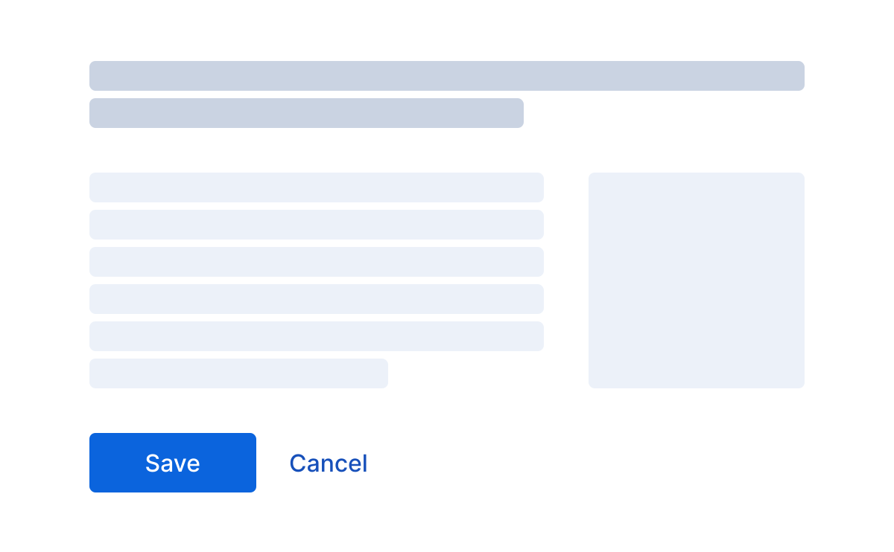
  </Guideline>
  <Guideline type="dont" text="Put the actions far away from the content.">
    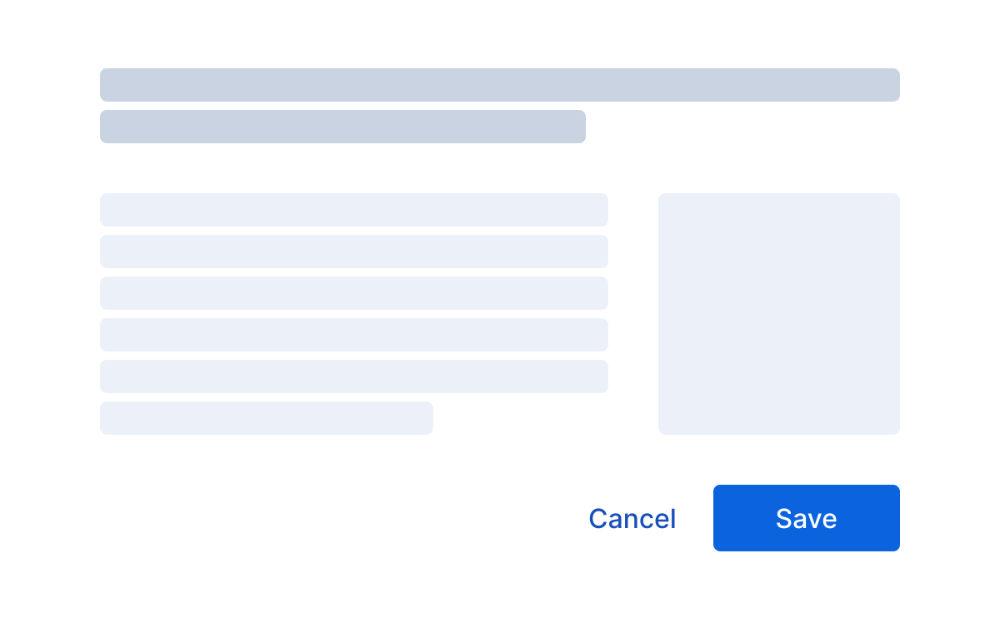
  </Guideline>
</EuiFlexGroup>

Button placement should always reflect the surrounding context. Place the primary action (e.g. Create) in the top-right corner **near the page title** when the view contains structured content. For empty states — where space is limited and the focus is on **guiding** the user — center-align both the title and the primary action.

<EuiFlexGroup gutterSize="m">
  <Guideline type="do" text="If the action is against the page title, place the primary button in the upper right.">
    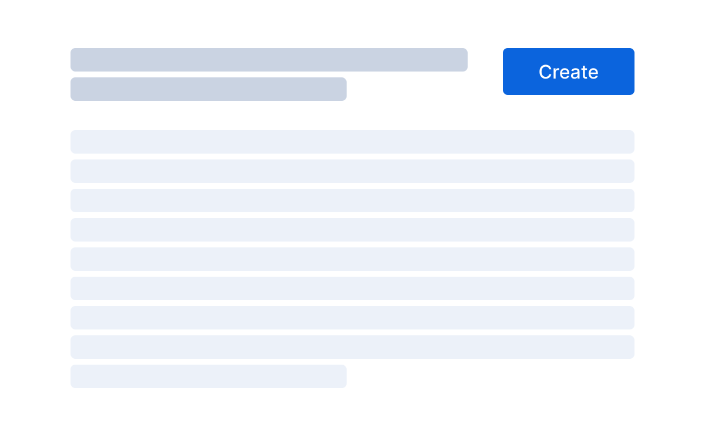
  </Guideline>
  <Guideline type="do" text="Center-align the title and primary action when content is minimal and vertically constrained.">
    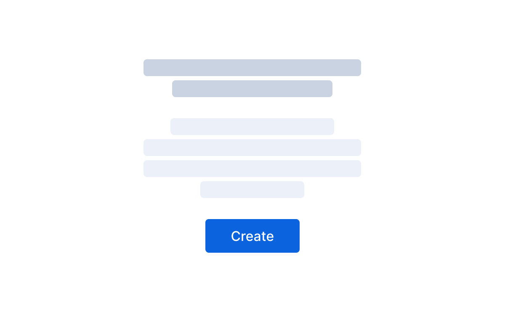
  </Guideline>
</EuiFlexGroup>

### Split buttons

EUI does not specifically support split buttons. Instead, use separate `EuiButton` and `EuiButtonIcon` components, matching their `display` and `size` props for consistency.

```tsx interactive
import React, { useState } from 'react';

import {
  EuiButton,
  EuiButtonIcon,
  EuiFlexGroup,
  EuiFlexItem,
  EuiContextMenuPanel,
  EuiContextMenuItem,
  EuiPopover,
  useGeneratedHtmlId,
} from '@elastic/eui';

export default () => {
  const [isPopoverOpen, setPopover] = useState(false);
  const splitButtonPopoverId = useGeneratedHtmlId({
    prefix: 'splitButtonPopover',
  });

  const onButtonClick = () => {
    setPopover(!isPopoverOpen);
  };

  const closePopover = () => {
    setPopover(false);
  };

  const items = [
    <EuiContextMenuItem key="copy" icon="copy" onClick={closePopover}>
      Copy
    </EuiContextMenuItem>,
    <EuiContextMenuItem key="edit" icon="pencil" onClick={closePopover}>
      Edit
    </EuiContextMenuItem>,
    <EuiContextMenuItem key="share" icon="share" onClick={closePopover}>
      Share
    </EuiContextMenuItem>,
  ];

  return (
    <>
      <EuiFlexGroup responsive={false} gutterSize="xs" alignItems="center">
        <EuiFlexItem grow={false}>
          <EuiButton size="s" fill iconType="save">
            Save
          </EuiButton>
        </EuiFlexItem>
        <EuiFlexItem grow={false}>
          <EuiPopover
            id={splitButtonPopoverId}
            button={
              <EuiButtonIcon
                display="fill"
                size="s"
                iconType="boxesVertical"
                aria-label="More"
                onClick={onButtonClick}
              />
            }
            isOpen={isPopoverOpen}
            closePopover={closePopover}
            panelPaddingSize="none"
            anchorPosition="downLeft"
          >
            <EuiContextMenuPanel size="s" items={items} />
          </EuiPopover>
        </EuiFlexItem>
      </EuiFlexGroup>
    </>
  );
};
```

### Popover buttons

Combine multiple actions into a single button with a popover menu to reduce group size.

```mdx-code-block
import ContextMenu from './guidelines_context_menu';
import BrowserOnly from '@docusaurus/BrowserOnly';
```

<EuiFlexGroup>
  <Guideline type="do" text="Put multiple actions inside a menu triggered by a single rather than showing them separately.">
    {/* ContextMenu uses EuiPopover that's SSR-incompatible */}
    <BrowserOnly>
      {() => <ContextMenu />}
    </BrowserOnly>
  </Guideline>
  <Guideline type="dont" text="When there are many buttons, none matter.">
    <EuiFlexGroup gutterSize="s">
      <EuiFlexItem grow={false}>
        <EuiButton iconType="copy">Copy</EuiButton>
      </EuiFlexItem>
      <EuiFlexItem grow={false}>
        <EuiButton iconType="pencil">Edit</EuiButton>
      </EuiFlexItem>
      <EuiFlexItem grow={false}>
        <EuiButton iconType="share">Share</EuiButton>
      </EuiFlexItem>
    </EuiFlexGroup>
  </Guideline>
</EuiFlexGroup>

### Toggle button

Create toggle buttons with `EuiButton`, `EuiButtonEmpty`, or `EuiButtonIcon` using state management for visual changes.

If the button's **readable text** (children or `aria-label`) changes when toggling the button, no additional accessibility concern exists.

```tsx interactive
import React, { useState } from 'react';

import { EuiButton, EuiButtonIcon } from '@elastic/eui';

export default () => {
  const [toggle0On, setToggle0On] = useState(false);
  const [toggle1On, setToggle1On] = useState(true);

  return (
    <>
      <EuiButton
        onClick={() => {
          setToggle0On((isOn) => !isOn);
        }}
      >
        {toggle0On ? 'Toggled' : 'Toggle me'}
      </EuiButton>
      &emsp;
      <EuiButtonIcon
        size="s"
        title={toggle1On ? 'Play' : 'Pause'}
        aria-label={toggle1On ? 'Play' : 'Pause'}
        iconType={toggle1On ? 'play' : 'pause'}
        onClick={() => {
          setToggle1On((isOn) => !isOn);
        }}
      />
    </>
  );
};
```

If only the **visual appearance** changes, add `aria-pressed` with a boolean for on/off states. All EUI button types provide an `isSelected` helper prop for this.

```tsx interactive
import React, { useState } from 'react';
import { EuiButton, EuiButtonIcon } from '@elastic/eui';

export default () => {
  const [toggle2On, setToggle2On] = useState(true);
  const [toggle3On, setToggle3On] = useState(false);

  return (
    <>
      <EuiButton
        isSelected={toggle2On}
        fill={toggle2On}
        iconType={toggle2On ? 'starFilledSpace' : 'starPlusEmpty'}
        onClick={() => {
          setToggle2On((isOn) => !isOn);
        }}
      >
        Toggle me
      </EuiButton>
      &emsp;
      <EuiButtonIcon
        display={toggle3On ? 'base' : 'empty'}
        size="m"
        aria-label="Autosave"
        title="Autosave"
        iconType="save"
        aria-pressed={toggle3On}
        color={toggle3On ? 'success' : 'text'}
        onClick={() => {
          setToggle3On((isOn) => !isOn);
        }}
      />
    </>
  );
};
```

:::accessibility Accessibility
Do not add `aria-pressed` or `isSelected` if the readable text changes.
:::

### Save button

Save buttons are specific to CRUD operations. "Save" is recommended for **permanently** saving data, rather than "Update," "Create," or "Apply." Reserve "Apply" for temporary changes.

<EuiFlexGroup gutterSize="m">
  <Guideline type="do" text="Place the primary action on the bottom right with the secondary action on its left in modals.">
    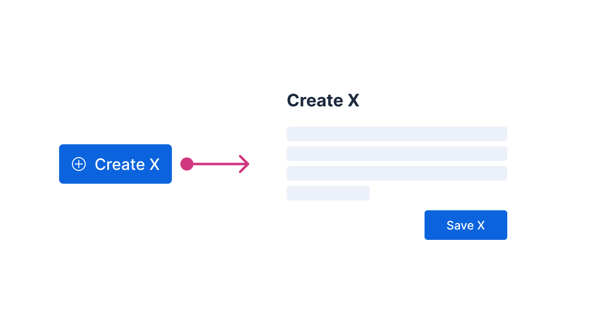
  </Guideline>
  <Guideline type="do" text="Always use buttons positioned to the right in popovers.">
    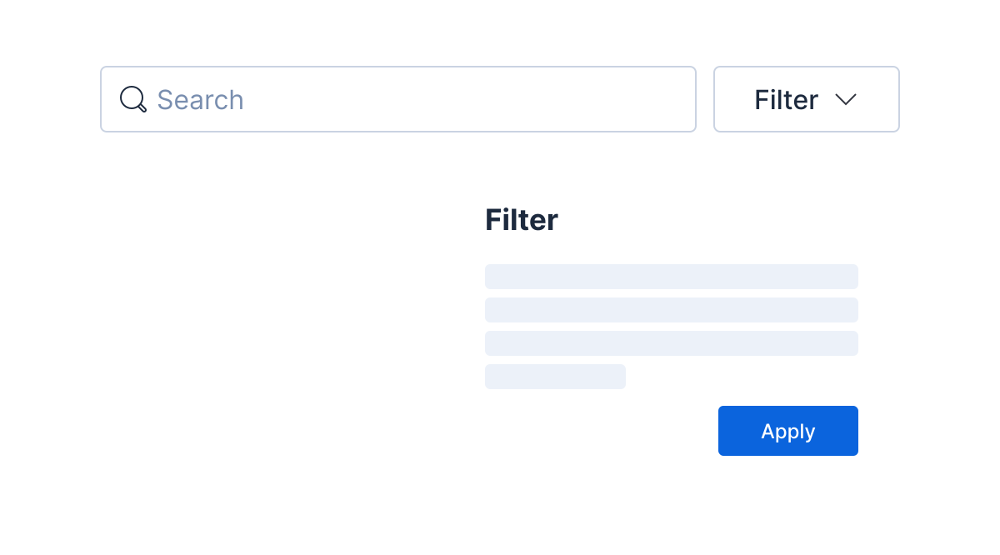
  </Guideline>
</EuiFlexGroup>

The save button should be the **most dominant** action, consistent across contexts. Use the `fill` property and `primary` color variant, including a noun in the label (e.g., "Save dashboard"). An icon for "Save" button typically **is not needed**. Save buttons should be visually dominant, making an icon less necessary compared to other actions. Rely solely on the label to avoid inconsistency. Exceptions exist, such as the `EuiInlineEdit` component, which offers a save action without a label.

<EuiFlexGroup>
  <Guideline type="do" text="Save button is a clear dominant within a group of actions.">
    <EuiFlexGroup gutterSize="s" justifyContent="flexEnd">
      <EuiFlexItem grow={false} >
        <EuiButtonEmpty>Tertiary</EuiButtonEmpty>
      </EuiFlexItem>
      <EuiFlexItem grow={false}>
        <EuiButton>Secondary</EuiButton>
      </EuiFlexItem>
      <EuiFlexItem grow={false}>
        <EuiButton fill>Save</EuiButton>
      </EuiFlexItem>
    </EuiFlexGroup>
  </Guideline>
  <Guideline type="dont" text="Even though there are only two buttons, 'Save' should still be the primary action.">
    <EuiFlexGroup gutterSize="s" justifyContent="flexEnd">
      <EuiFlexItem grow={false}>
        <EuiButtonEmpty>Cancel</EuiButtonEmpty>
      </EuiFlexItem>
      <EuiFlexItem grow={false}>
        <EuiButton>Apply</EuiButton>
      </EuiFlexItem>
    </EuiFlexGroup>
  </Guideline>
</EuiFlexGroup>

## Props

import docgen from '@elastic/eui-docgen/dist/components/button';

<PropTable definition={docgen.EuiButton} />
<PropTable definition={docgen.EuiButtonEmpty} />
<PropTable definition={docgen.EuiButtonIcon} />
