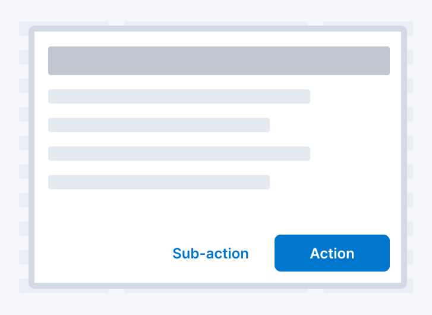
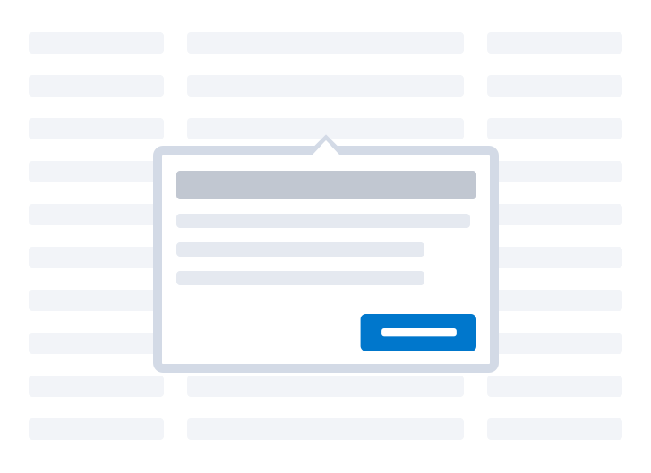
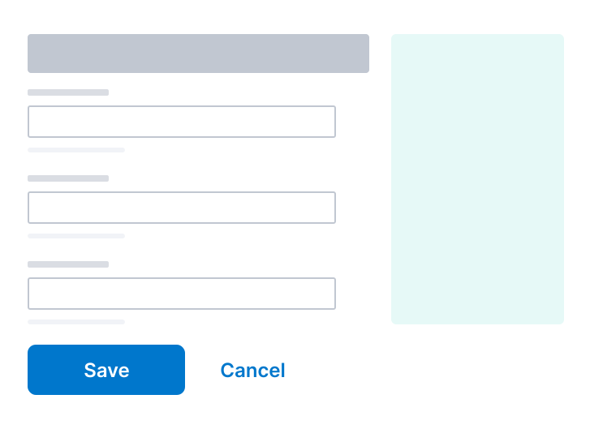
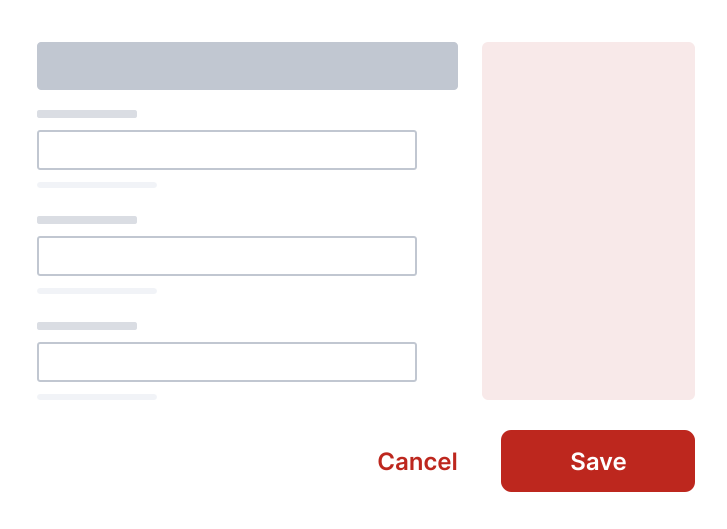
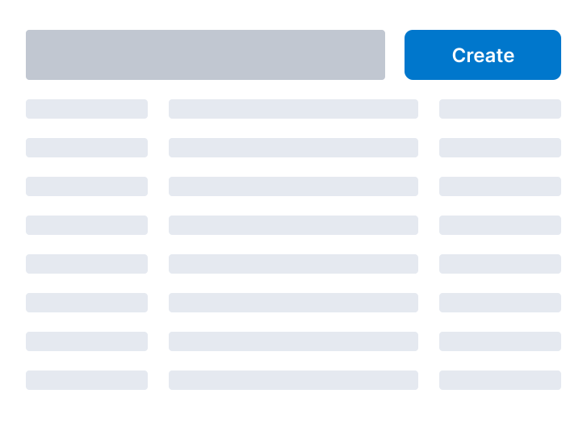
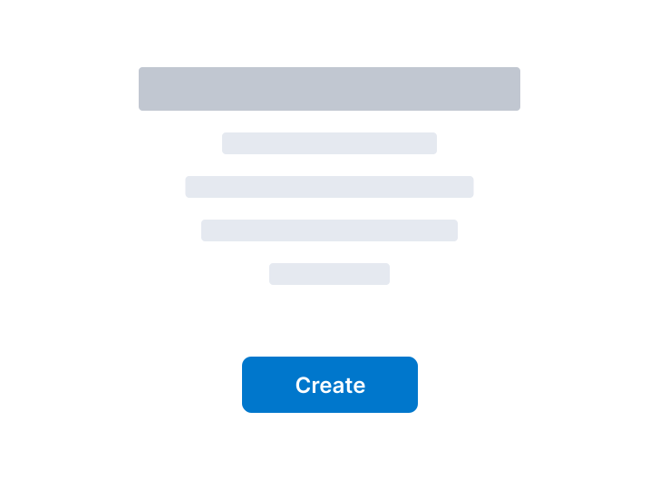
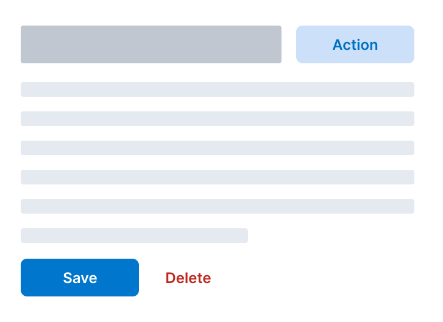
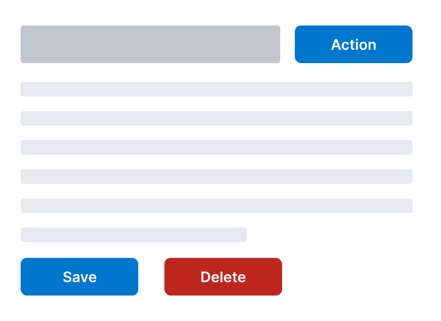

# Button guidelines

```mdx-code-block
import { EuiFlexGroup, EuiFlexItem, EuiButton, EuiButtonEmpty, EuiButtonIcon, EuiIcon, EuiTable, EuiTableBody, EuiTableHeader, EuiTableHeaderCell, EuiTableRow, EuiTableRowCell } from '@elastic/eui';
```

This page documents patterns for button design, including types, placement, color, and size.

## Button types

<dl>
  <EuiFlexGroup direction="column" gutterSize="m">
    <EuiFlexGroup alignItems="center">
      <EuiFlexItem grow={false} style={{ minWidth: 120 }}>
        <EuiButton fill>Filled</EuiButton>
      </EuiFlexItem>

      <EuiFlexItem>
        <dt>
          **Filled buttons are for the primary action**
        </dt>
        <dd>
          This button has the heaviest visual weight to draw users' attention.
        </dd>
      </EuiFlexItem>
    </EuiFlexGroup>

    <EuiFlexGroup alignItems="center">
      <EuiFlexItem grow={false} style={{ minWidth: 120 }}>
        <EuiButton>Standard</EuiButton>
      </EuiFlexItem>

      <EuiFlexItem>
        <dt>
          **Standard buttons are for secondary actions**
        </dt>
        <dd>
          Such actions include Add and Apply. This button type works well
          for multiple actions of equal weight.
        </dd>
      </EuiFlexItem>
    </EuiFlexGroup>

    <EuiFlexGroup alignItems="center">
      <EuiFlexItem grow={false} style={{ minWidth: 120 }}>
        <EuiButtonEmpty>Empty</EuiButtonEmpty>
      </EuiFlexItem>

      <EuiFlexItem>
        <dt>
          **Empty buttons are for complementary, UI-specific actions**
        </dt>
        <dd>
          Close, cancel, filter, refresh, and other actions that reconfigure the UI are appropriate for empty buttons.
        </dd>
      </EuiFlexItem>
    </EuiFlexGroup>

    <EuiFlexGroup alignItems="center">
      <EuiFlexItem grow={false} style={{ minWidth: 120 }}>
        <div style={{ textAlign: 'center' }}>
          <EuiButtonIcon
            size="s"
            color="danger"
            onClick={() => {}}
            iconType="trash"
            aria-label="Next"
          />
        </div>
      </EuiFlexItem>

      <EuiFlexItem>
        <dt>
          **Icon buttons are for saving space**
        </dt>
        <dd>
          The icon must be immediately understood, for example, a trash can for delete. Use these buttons sparingly, and never for the primary action.
        </dd>
      </EuiFlexItem>
    </EuiFlexGroup>
  </EuiFlexGroup>
</dl>

## Placement and order

Button placement and order should follow the user path.

### Put buttons on the right in containers with a restricted width

In contained spaces like modals, popovers, bottom bars, and flyouts, the user path is top to bottom, left to right, in a Z-shaped pattern. Placing buttons on the bottom right puts them right where users finish scanning.

<EuiFlexGroup gutterSize="m">
  <Guideline type="do" text="Place the primary action on the bottom right with the secondary action on its left in modals.">
    
  </Guideline>
  <Guideline type="do" text="Always use buttons positioned to the right in popovers.">
    
  </Guideline>
</EuiFlexGroup>

### Put buttons on the left in unrestricted containers

With large page forms, content is typically concentrated on the top and left with a lot of open space to the right. The user path is top to bottom, in an F-shaped pattern.

<EuiFlexGroup gutterSize="m">
  <Guideline type="do" text="Put the primary action in the leftmost position so the user's eye never has to leave the one side.">
    
  </Guideline>
  <Guideline type="dont" text="Put the actions far away from the content.">
    
  </Guideline>
</EuiFlexGroup>

### Other patterns

Button should always fit the surrounding context and stay consistent with the app.

<EuiFlexGroup gutterSize="m">
  <Guideline type="do" text="If the action is against the page title, place the primary button in the upper right. A common pattern is a create button that adds an item to a list. Creation starts at the top and ends at the bottom. Think of it as adding to a pile.">
    
  </Guideline>
  <Guideline type="do" text="Empty states are unique because they focus first on information and then try to sell the user on creation. In these special cases, where the container is constrained and the content is fairly short, the title and the button should be center aligned.">
    
  </Guideline>
</EuiFlexGroup>

## One primary button per layout

The primary action should not have to compete for attention. Use only one filled button per page, modal, form, or other layout.

<EuiFlexGroup gutterSize="m">
  <Guideline type="do" text="Use only one filled button per layout. The primary action is the one you want the user to eventually complete.">
    
  </Guideline>
  <Guideline type="dont" text="Too many primary buttons will confuse the user.">
    
  </Guideline>
</EuiFlexGroup>

### Minimize the mixing of color, size, and type

When in doubt, use a blue button in the default size and never put more than two visual styles next to each other.

<EuiFlexGroup gutterSize="m">
  <Guideline type="do" text="Stick to the default pattern: a filled, primary button paired with an empty, but same-colored button.">
    <EuiFlexGroup>
      <EuiFlexItem grow={false}>
        <EuiButton fill>Save</EuiButton>
      </EuiFlexItem>
      <EuiFlexItem grow={false}>
        <EuiButtonEmpty>Cancel</EuiButtonEmpty>
      </EuiFlexItem>
    </EuiFlexGroup>
  </Guideline>
  <Guideline type="dont" text="Readability suffers when multiple colors and sizes are used.">
    <EuiFlexGroup>
      <EuiFlexItem grow={false}>
        <EuiButton fill>Save</EuiButton>
      </EuiFlexItem>
      <EuiFlexItem grow={false}>
        <EuiButton>Cancel</EuiButton>
      </EuiFlexItem>
      <EuiFlexItem grow={false}>
        <EuiButton color="danger" fill size="s">
          Delete
        </EuiButton>
      </EuiFlexItem>
    </EuiFlexGroup>
  </Guideline>
</EuiFlexGroup>

## Icons in buttons either stand on their own or add context

Icon buttons can save space. Limit icon buttons to groups of two, otherwise they lose meaning.

<EuiFlexGroup gutterSize="m">
  <Guideline type="do" text="Use icon buttons for universal actions that are easy to understand.">
    <EuiButtonIcon size="s" iconType="pencil" aria-label="Edit" />&nbsp;&nbsp;&nbsp;&nbsp;<EuiButtonIcon size="s" iconType="expand" aria-label="Expand" />
  </Guideline>
  <Guideline type="dont" text="Icons alone in a standard button defeats the purpose of saving space.">
    <EuiButton><EuiIcon type="pencil" aria-label="Edit" /></EuiButton>&nbsp;&nbsp;<EuiButton><EuiIcon type="expand" aria-label="Expand" /></EuiButton>
  </Guideline>
</EuiFlexGroup>

Icons can serve as a scanning aid in a text label, but keep to a minimum. Icons work best on labels for binary actions, for example, Create and Delete, and final actions, such as Save.

<EuiFlexGroup gutterSize="m">
  <Guideline type="do" text={`Use icons to emphasize actions. The arrow on the Continue button lets users know they still have more items to fill out. Using the word "complete" with a rare check icon helps users understand that this is the final action.`}>
    <EuiButton iconType="arrowRight" iconSide="right" fill>Continue</EuiButton>&nbsp;&nbsp;<EuiButton iconType="check" color="success" fill>Save and complete</EuiButton>
  </Guideline>
  <Guideline type="dont" text="Unnecessary icons often distract from the text. This is especially true when the icon is positioned on the right, with a hard to interpret icon.">
    <EuiButton iconType="indexOpen" iconSide="right" fill>Create index pattern</EuiButton>
  </Guideline>
</EuiFlexGroup>


## Stack action sets into one button

Two buttons are optimal for a side-by-side layout, three is rare. For more buttons, use a dropdown or context menu.

```mdx-code-block
import ContextMenu from './guidelines_context_menu';
import BrowserOnly from '@docusaurus/BrowserOnly';
```

<EuiFlexGroup gutterSize="m">
  <Guideline type="do" text="Put multiple actions inside a menu triggered by a single rather than showing them separately.">
    {/* ContextMenu uses EuiPopover that's SSR-incompatible */}
    <BrowserOnly>
      {() => <ContextMenu />}
    </BrowserOnly>
  </Guideline>
  <Guideline type="dont" text="When there are many buttons, none matter.">
    <EuiFlexGroup>
      <EuiFlexItem grow={false}>
        <EuiButton iconType="copy">Copy</EuiButton>
      </EuiFlexItem>
      <EuiFlexItem grow={false}>
        <EuiButton iconType="pencil">Edit</EuiButton>
      </EuiFlexItem>
      <EuiFlexItem grow={false}>
        <EuiButton iconType="share">Share</EuiButton>
      </EuiFlexItem>
    </EuiFlexGroup>
  </Guideline>
</EuiFlexGroup>


## Labels that say what the button does

Labels should provide a clear indication of that action that occurs when the user clicks the button. Prefer action words, and include an object when it is not clear from the context, for example, Add dashboard. Labels should be three words or fewer. If your label requires more words, consider using a text link instead.

### Preferred words in buttons

<EuiTable>
  <EuiTableHeader>
    <EuiTableHeaderCell>Text</EuiTableHeaderCell>
    <EuiTableHeaderCell>Description</EuiTableHeaderCell>
  </EuiTableHeader>

  <EuiTableBody>
    <EuiTableRow>
      <EuiTableRowCell mobileOptions={{ width: '100%' }}>
        <EuiButton>Add thing</EuiButton>
      </EuiTableRowCell>

      <EuiTableRowCell>Establishes a new relationship. Often used in a create-then-add scenario. You create a dashboard, then add a visualization. Always followed by an object. Do not use &quot;Add new.&quot; Remove is the correct opposite.</EuiTableRowCell>
    </EuiTableRow>

    <EuiTableRow>
      <EuiTableRowCell mobileOptions={{ width: '100%' }}>
        <EuiButtonEmpty size="s">Cancel</EuiButtonEmpty>
      </EuiTableRowCell>
      <EuiTableRowCell>Stops an action without saving pending changes. Never make Cancel red&mdash;it's not a destructive action. Cancel is always an empty button.</EuiTableRowCell>
    </EuiTableRow>

    <EuiTableRow>
      <EuiTableRowCell mobileOptions={{ width: '100%' }}>
        <EuiButton fill>Create thing</EuiButton>
      </EuiTableRowCell>

      <EuiTableRowCell>Creates a new object from scratch. Always followed by an object, for example, “Create pipeline.” Do not use &quot;Create new.&quot;Exception: “Add user” is more intuitive than “Create user.” Delete is the correct opposite.</EuiTableRowCell>
    </EuiTableRow>

    <EuiTableRow>
      <EuiTableRowCell mobileOptions={{ width: '100%' }}>
        <EuiButton color="danger" fill>Delete</EuiButton>&nbsp;&nbsp;
        <EuiButton color="danger" fill>Delete 6 things</EuiButton>&nbsp;&nbsp;<EuiButtonIcon
          size="s"
          color="danger"
          iconType="trash"
          aria-label="delete"
        />
      </EuiTableRowCell>

      <EuiTableRowCell>Deletes data so users can longer retrieve it. Create is the correct opposite. Do not confuse with Remove.</EuiTableRowCell>
    </EuiTableRow>

    <EuiTableRow>
      <EuiTableRowCell mobileOptions={{ width: '100%' }}>
        <EuiButton color="danger">Remove</EuiButton>&nbsp;&nbsp;<EuiButtonIcon
          size="s"
          color="danger"
          iconType="cross"
          aria-label="Remove"
        />
      </EuiTableRowCell>
      <EuiTableRowCell>Removes a relationship, but doesn't permanently delete data. For example, you remove a visualization from a dashboard. Add is the correct opposite.</EuiTableRowCell>
    </EuiTableRow>

    <EuiTableRow>
      <EuiTableRowCell mobileOptions={{ width: '100%' }}>
        <EuiButton fill>Save</EuiButton>&nbsp;&nbsp;
        <EuiButton fill color="success" iconType="check">Save and complete</EuiButton>
      </EuiTableRowCell>
      <EuiTableRowCell>Carries out pending changes, for example, Save edits. Do not confuse with Add. Can use green if this button is the final save action.</EuiTableRowCell>
    </EuiTableRow>
  </EuiTableBody>
</EuiTable>

### Avoid these words in buttons

<EuiTable responsive={false}>
  <EuiTableHeader>
    <EuiTableHeaderCell>Text</EuiTableHeaderCell>
    <EuiTableHeaderCell>Use this instead</EuiTableHeaderCell>
  </EuiTableHeader>
  <EuiTableBody>
    <EuiTableRow>
      <EuiTableRowCell>
        <EuiButton>New</EuiButton>
      </EuiTableRowCell>

      <EuiTableRowCell>Add or Create</EuiTableRowCell>
    </EuiTableRow>

    <EuiTableRow>
      <EuiTableRowCell>
        <EuiButton>OK</EuiButton>
      </EuiTableRowCell>

      <EuiTableRowCell>Words that explain the action</EuiTableRowCell>
    </EuiTableRow>

    <EuiTableRow>
      <EuiTableRowCell>
        <EuiButton>Yes?</EuiButton>&nbsp;&nbsp;
        <EuiButton color="danger">No?</EuiButton>
      </EuiTableRowCell>

      <EuiTableRowCell>Words that explain the action</EuiTableRowCell>
    </EuiTableRow>
  </EuiTableBody>
</EuiTable>
