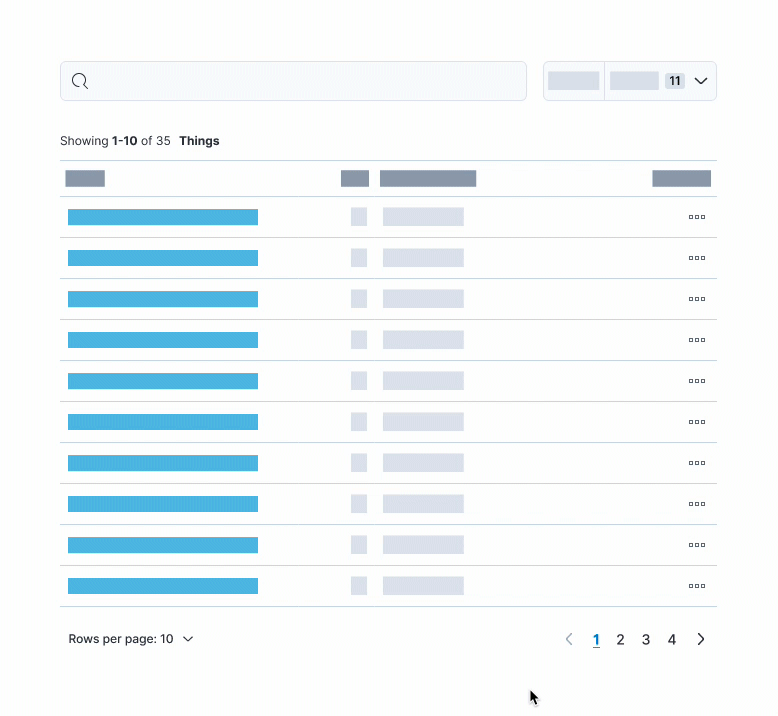
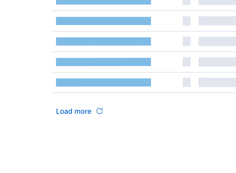
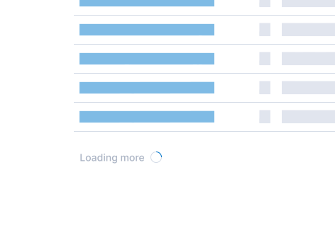

```mdx-code-block
import { EuiPanel, EuiButtonEmpty, EuiContextMenuItem, EuiFlexGroup, EuiSpacer, EuiBasicTable } from '@elastic/eui';
import Link from '@docusaurus/Link';
```

## Don’t rely on pagination for users to find what they’re looking for

For any results-style table, always provide ways to filter, search, etc for the thing that the user wants. Pagination is only helpful once the user has reduced the 1000+ results to just 100 (for example).

<EuiPanel
  color="subdued"
  paddingSize="l"
  hasShadow={false}
  style={{
    display: 'flex',
    flexDirection: 'column',
    alignItems: 'center',
  }}
>
  

  [Full prototype](https://www.figma.com/proto/RzfYLj2xmH9K7gQtbSKygn/Elastic-UI?page-id=15025%3A1&node-id=22522%3A276461&viewport=441%2C48%2C0.28&scaling=min-zoom&starting-point-node-id=22522%3A276461)
</EuiPanel>

## Don’t rely on pagination to indicate total results

When possible, always present a clear indicator of how many (and if not all results) have been returned. Just a simple count will do. Including a detailed summary of results at the top of the table or list goes a long way to signify what paging can’t.

### Indicate indeterminate results

If you cannot provide a concrete number of results, you still have to communicate what the current results showcase. For instance, say "Showing first 100 results" or "Search results maxed at 1000" or "Results fetched at runtime".

_Remember that not all users understand how your data API works. They just care about the data that's being shown to them._

---

## Give users control of pagination

Providing a [“Rows per page” option](/docs/navigation/pagination#customizable-pagination) is often helpful enough to provide users control over the amount of data they see at once.

Keep the choices simple and only show “Rows per page” if there are more rows than the smallest option. For example, if there are only 9 rows and the smallest option is 10 rows per page, hide the selector.

<EuiFlexGroup gutterSize="m">
  <Guideline type="do" text="For shorter sets of data, you may want to include an “Show all” option." panelStyle={{ minHeight: 310 }}>
    <EuiButtonEmpty
      size="xs"
      color="text"
      iconType="arrowDown"
      iconSide="right"
    >Rows per page: 10</EuiButtonEmpty>
    <EuiSpacer size="s" />
    <EuiPanel paddingSize="none" hasShadow>
      <EuiContextMenuItem key="10 rows" icon={'check'}>10 rows</EuiContextMenuItem>
      <EuiContextMenuItem key="20 rows" icon={'empty'}>20 rows</EuiContextMenuItem>
      <EuiContextMenuItem key="50 rows" icon={'empty'}>50 rows</EuiContextMenuItem>
    </EuiPanel>
  </Guideline>
  <Guideline type="dont" text="Overload the user with choices, stick to only 2-3 options." panelStyle={{ minHeight: 310 }}>
    <EuiButtonEmpty
      size="xs"
      color="text"
      iconType="arrowDown"
      iconSide="right"
    >Rows per page: 10</EuiButtonEmpty>
    <EuiSpacer size="s" />
    <EuiPanel paddingSize="none" hasShadow>
      <EuiContextMenuItem key="10 rows" icon={'check'}>10 rows</EuiContextMenuItem>
      <EuiContextMenuItem key="15 rows" icon={'empty'}>15 rows</EuiContextMenuItem>
      <EuiContextMenuItem key="20 rows" icon={'empty'}>20 rows</EuiContextMenuItem>
      <EuiContextMenuItem key="30 rows" icon={'empty'}>30 rows</EuiContextMenuItem>
      <EuiContextMenuItem key="50 rows" icon={'empty'}>50 rows</EuiContextMenuItem>
    </EuiPanel>
  </Guideline>
</EuiFlexGroup>

### Optimize your defaults

Most users don’t customize the default view. Therefore, it’s vital that you provide optimal defaults and reduce complexity as the number of entries increase. This means choosing a default “Rows per page” that best corresponds to the total results. For instance, 1000+ results shouldn’t start with 10 rows per page, but rather 20 or 50.

Here are some **samples** of what controls to provide based on the number of data entries.

<EuiBasicTable
  columns={[
    {
      field: 'entries',
      name: 'Total entries',
      valign: 'top',
    },
    {
      field: 'rows',
      name: 'Rows per page options',
      render: (rows) => rows,
      valign: 'top',
    },
    {
      field: 'style',
      name: 'Pagination style',
      render: (style) => style,
      valign: 'top',
    },
  ]}
  items={[
    {
      entries: '0',
      rows: (
        <span>
          Use{' '}
          <Link to="/docs/display/empty-prompt">
            <strong>EuiEmptyPrompt</strong>
          </Link>{' '}
          in place of table
        </span>
      ),
      style: 'N/A',
    },
    {
      entries: 'Less than 50',
      rows: 'Show 10, but allow All',
      style: <Link to="/docs/navigation/pagination#few-pages">Numbered</Link>,
    },
    {
      entries: '51 - 100',
      rows: '10, 20, All',
      style: (
        <Link to="/docs/navigation/pagination#basic-usage-with-many-pages">
          Numbered
        </Link>
      ),
    },
    {
      entries: '101 - 200',
      rows: '10, 20, 50',
      style: (
        <span>
          <Link to="/docs/navigation/pagination#basic-usage-with-many-pages">
            Numbered
          </Link>{' '}
          or{' '}
          <Link to="/docs/navigation/pagination#compressed-and-responsive">
            Compressed
          </Link>
        </span>
      ),
    },
    {
      entries: 'More than 200',
      rows: '20, 50, 100',
      style: (
        <span>
          <Link to="/docs/navigation/pagination#basic-usage-with-many-pages">
            Numbered
          </Link>{' '}
          or{' '}
          <Link to="/docs/navigation/pagination#indeterminate-page-count">
            Indeterminate
          </Link>
        </span>
      ),
    },
    {
      entries: 'Unknown',
      rows: (
        <span>
          Depends on what you <em>expect</em> the total entries to be
        </span>
      ),
      style: (
        <Link to="/docs/navigation/pagination#indeterminate-page-count">
          Indeterminate
        </Link>
      ),
    },
  ]}
/>

If the total results are unknown, you can make a best guess based on the context of that specific table, whether there’s **most likely** going to be tens or thousands of results. From there you can decide to show 10 rows per page or 20 by default.

**The complexity of the data will also contribute to this equation, which is why the table above is just a sample.**

* * *

## Preserve the user-customized state of pagination

When providing pagination, customizable display options, and data filters, always save the user’s state in some form. This is especially important if your data includes links that navigate a user away from the current view. There’s nothing more frustrating for users than going back to find their filters and pagination have been reset.

Below is a working example that utilizes `localStorage` to save the table’s state.

```mdx-code-block
import { faker } from '@faker-js/faker';
```

<Demo scope={{ faker }}>
  ```tsx
  import React, { useState } from 'react';
  import {
    EuiBasicTable,
    EuiLink,
    EuiSpacer,
    EuiHorizontalRule,
    EuiText,
    formatDate,
  } from '@elastic/eui';
  import { faker } from '@faker-js/faker';

  const PAGE_INDEX_KEY = 'paginationGuide_currentPage';
  const PAGE_COUNT_KEY = 'paginationGuide_pageCount';

  const raw_data = [];

  for (let i = 1; i < 25; i++) {
    const name = `${faker.person.lastName()}, ${faker.person.firstName()}`;
    const suffix = faker.person.suffix();
    raw_data.push({
      name: {
        formatted: `${name} ${suffix}`,
        raw: name,
      },
      location: (
        <span>
          {`${faker.location.city()}, `}
          <EuiLink href="https://google.com">{faker.location.country()}</EuiLink>
        </span>
      ),
      date: `${faker.date.past()}`,
      amount: faker.commerce.price(),
    });
  }

  export default () => {
    const [pageIndex, setPageIndex] = useState(
      Number(localStorage.getItem(PAGE_INDEX_KEY) || 0)
    );
    const [pageSize, setPageSize] = useState(
      Number(localStorage.getItem(PAGE_COUNT_KEY) || 10)
    );

    const onTableChange = ({ page = {} }) => {
      const { index: pageIndex, size: pageSize } = page;

      setPageIndex(pageIndex);
      setPageSize(pageSize);
      localStorage.setItem(PAGE_INDEX_KEY, String(pageIndex));
      localStorage.setItem(PAGE_COUNT_KEY, String(pageSize));
    };

    const totalItemCount = raw_data.length;
    const startIndex = pageIndex * pageSize;
    const pageOfItems =
      pageSize > 0
        ? raw_data.slice(
            startIndex,
            Math.min(startIndex + pageSize, totalItemCount)
          )
        : raw_data;

    const columns = [
      {
        field: 'name',
        name: 'Name',
        truncateText: true,
        render: (Name) => Name.formatted,
      },
      {
        field: 'location',
        name: 'Location',
        render: (location) => location,
      },
      {
        field: 'date',
        name: 'Date',
        dataType: 'date',
        render: (date) => formatDate(date, 'dobLong'),
      },
      {
        field: 'amount',
        name: 'Amount',
        dataType: 'number',
        width: '100px',
      },
    ];

    const pagination = {
      pageIndex,
      pageSize,
      totalItemCount,
      pageSizeOptions: [10, 0],
    };

    const resultsCount =
      pageSize === 0 ? (
        <strong>All</strong>
      ) : (
        <>
          <strong>
            {pageSize * pageIndex + 1}-
            {Math.min(pageSize * pageIndex + pageSize, totalItemCount)}
          </strong>{' '}
          of {totalItemCount}
        </>
      );

    return (
      <div>
        <EuiText size="xs">
          Showing {resultsCount} <strong>Users</strong>
        </EuiText>
        <EuiSpacer size="s" />
        <EuiHorizontalRule margin="none" style={{ height: 2 }} />
        <EuiBasicTable
          tableCaption="Demo for EuiBasicTable with pagination"
          items={pageOfItems}
          columns={columns}
          pagination={pagination}
          onChange={onTableChange}
        />
      </div>
    );
  };
  ```
</Demo>

### Don’t use infinite scrolling

Infinite scrolling, i.e. loading data as the user scrolls, is the exact opposite of being able to save the user’s pagination state. As soon as they navigate away from the page, their position in the list is lost. It’s better to increase the quantities of rows per page or provide a “Load more” action.

<EuiFlexGroup gutterSize="m">
  <Guideline type="do" text="Provide a direct action for users to initiate the loading of more data.">
    
  </Guideline>
  <Guideline type="dont" text="Use infinite scroll to automatically load more rows of data.">
    
  </Guideline>
</EuiFlexGroup>
