import { EuiFlexGroup } from '@elastic/eui';

## Converting from legacy layouts

Try to use as much of the namespaced (e.g. `<EuiPageTemplate.Header />`) as much as possible. This will ensure that top level props are propogated through and alignment is kept through the stacking order. You can use the non-namespaced versions (e.g. `<EuiPageSection>`) if you deliberately don't want the props to inherit.

import contentCenterSvg from '!url-loader!./content_center.svg';
import singleSvg from '!url-loader!./single.svg';

<Demo scope={{ singleSvg, contentCenterSvg }}>
  ```tsx
  import React from 'react';
  import { EuiPageTemplate, EuiPageSection, EuiImage } from '@elastic/eui';

  export default () => {
    return (
      <EuiPageTemplate
        bottomBorder="extended"
        minHeight="0"
        offset={0}
        style={{ height: 430 }}
      >
        {/* Sidebar content can now be instantiated anywhere and it will always be placed in the correct spot */}
        <EuiPageTemplate.Sidebar>
          <EuiImage size={'original'} alt="Fake side nav list" url={singleSvg} />
        </EuiPageTemplate.Sidebar>
        {/* This non-namespaced section will not be tied to the template ensuring it's display is always custom */}
        <EuiPageSection color="subdued">
          Some content before the page header
        </EuiPageSection>
        {/* Display a page header anywhere in the stack of contents */}
        <EuiPageTemplate.Header pageTitle="Page title" />
        {/* This template section overrides some default template props */}
        <EuiPageTemplate.Section grow={false} bottomBorder="extended">
          Some content after the page header
        </EuiPageTemplate.Section>
        {/* Empty prompts can be placed anywhere in the stack and not replace the entire page contents */}
        <EuiPageTemplate.EmptyPrompt>
          <EuiImage size={'l'} alt="Fake paragraph" url={contentCenterSvg} />
        </EuiPageTemplate.EmptyPrompt>
      </EuiPageTemplate>
    );
  };
  ```
</Demo>

<EuiFlexGroup gutterSize="m">
  <Guideline type="do" text="Use EuiPageTemplate with incorporated EuiPageTemplate.Header and EuiPageTemplate.Section">
    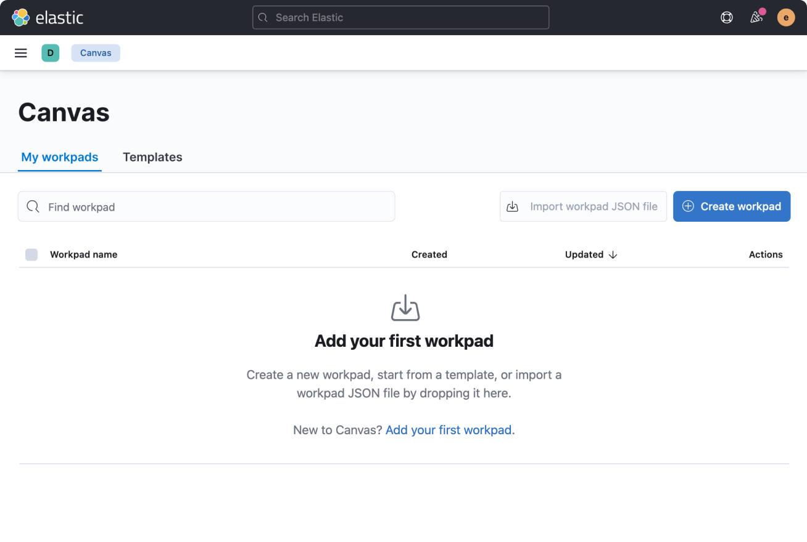
  </Guideline>
  <Guideline type="dont" text="Using plain EuiPage components for wrapping entire page layouts is very manual and no longer matches the template.">
    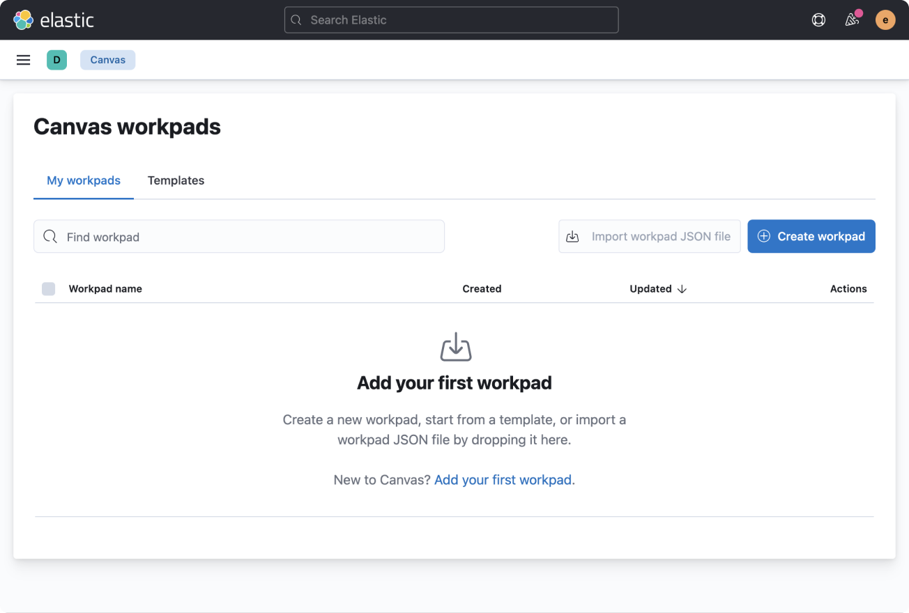
  </Guideline>
</EuiFlexGroup>

## When to center content

Whether or not the page has side navigation, any empty/loading/error states that take up the whole page should be vertically and horizontally centered using `alignment="center"` on the individual page section.

**Most empty states can utilize the `<EuiPageTemplate.EmptyState>` which will automatically center the content for you.**

<EuiFlexGroup gutterSize="m">
  <Guideline type="do" text="Use fully centered alignment for empty states even when using tabs.">
    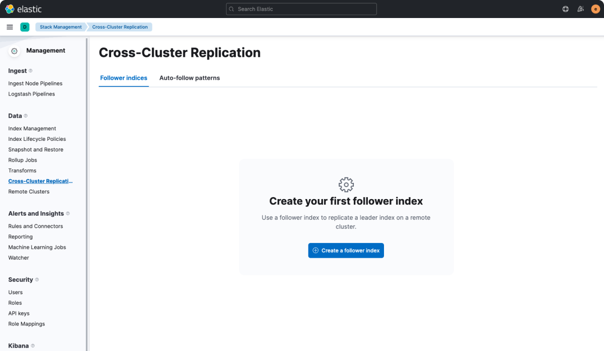
  </Guideline>
  <Guideline type="dont" text="Horizontally centered only content will mismatch the basic template.">
    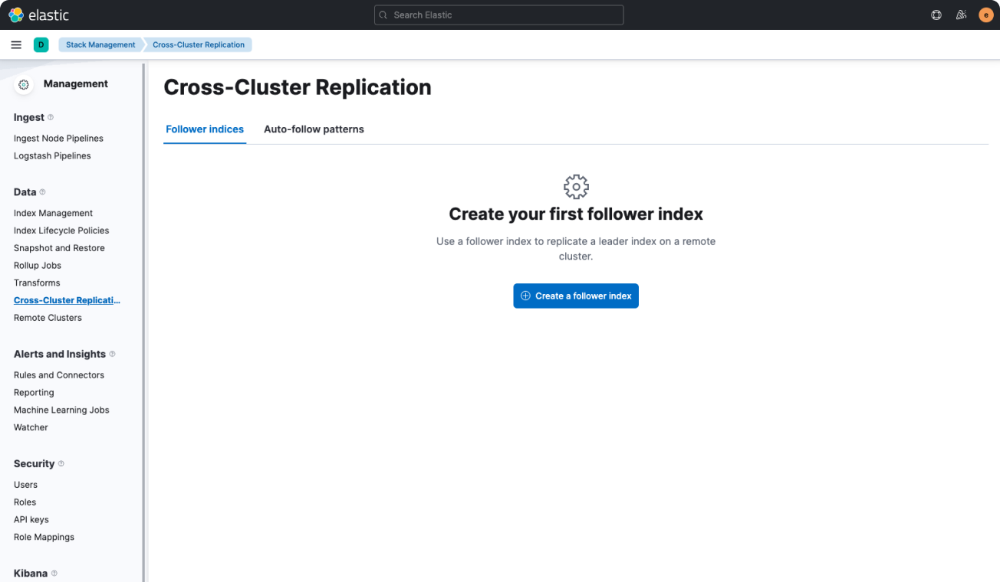
  </Guideline>
</EuiFlexGroup>

<EuiFlexGroup gutterSize="m">
  <Guideline type="do" text="Utilize the empty prompt component for fully empty pages and hide the page header.">
    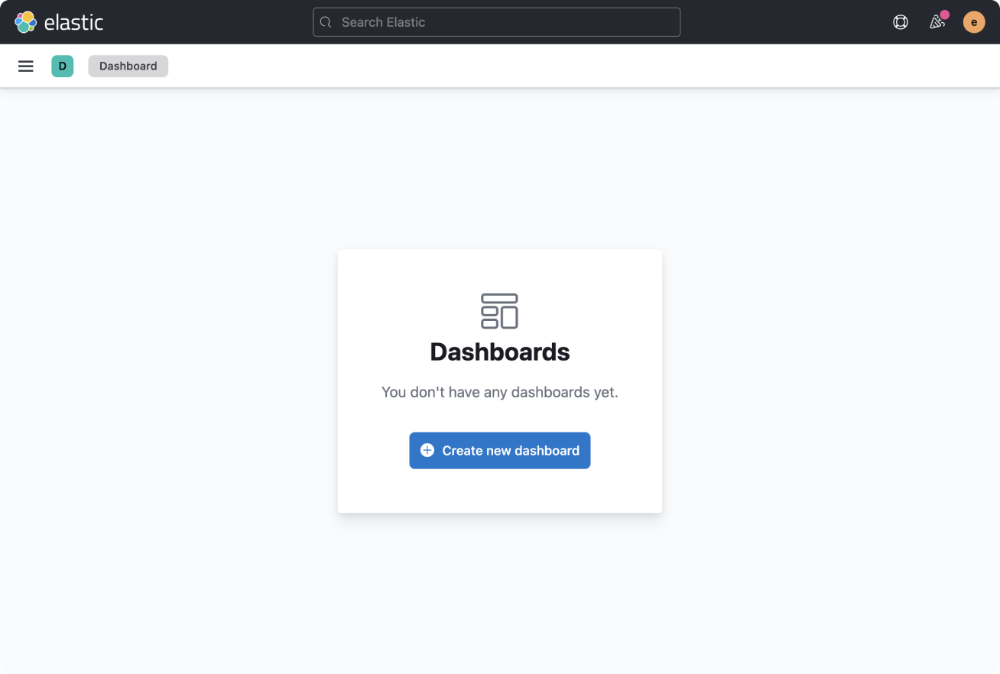
  </Guideline>
  <Guideline type="dont" text="Duplicate content between page header and empty state contents isn't helpful.">
    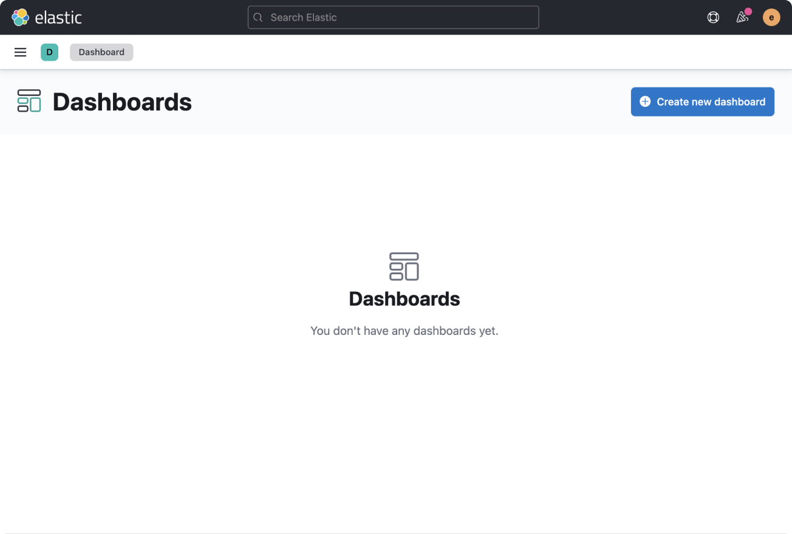
  </Guideline>
</EuiFlexGroup>

## Empty pages

### When the whole page is empty

Use the `EuiPageTemplate.EmptyPrompt` component to replace the whole page.

<EuiFlexGroup gutterSize="m">
  <Guideline type="do" text="Utilize the empty state component which automatically adds panelling and centering.">
    
  </Guideline>
  <Guideline type="dont" text="Just replacing page content with a simple sentence creates incorrect hierarchy.">
    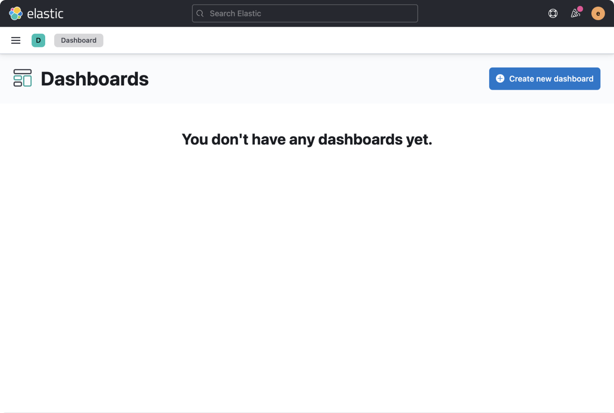
  </Guideline>
</EuiFlexGroup>

<EuiFlexGroup gutterSize="m">
  <Guideline type="do" text="Utilize the empty state component with a specific call to action.">
    
  </Guideline>
  <Guideline type="dont" text="Ambiguous empty state messages without any actions are not helpful.">
    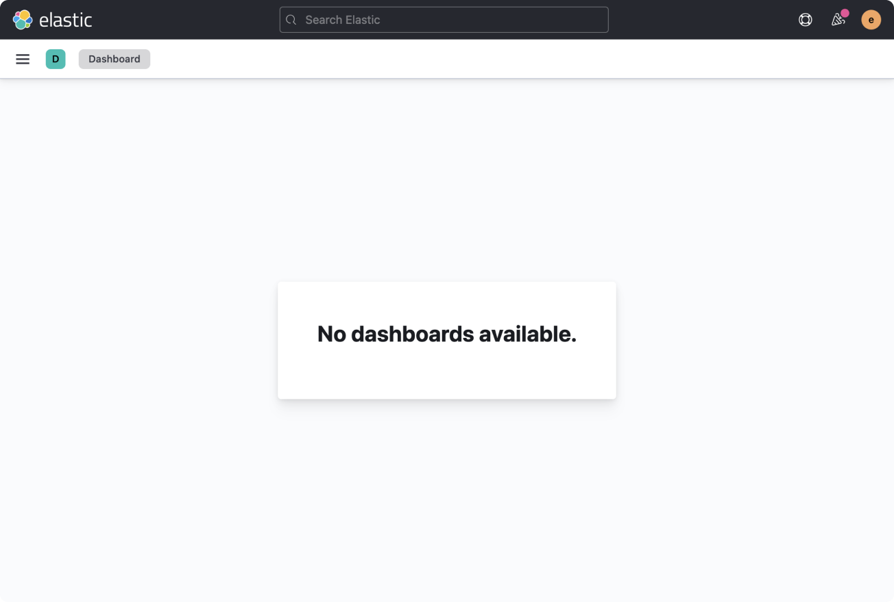
  </Guideline>
</EuiFlexGroup>

### Empty state due to insufficient permissions

Provide language that specifically points to permissions as the reason for the empty state. If possible, link to an admin contact.


<EuiFlexGroup gutterSize="m">
  <Guideline type="do" text="Provide more explanation within the empty state.">
    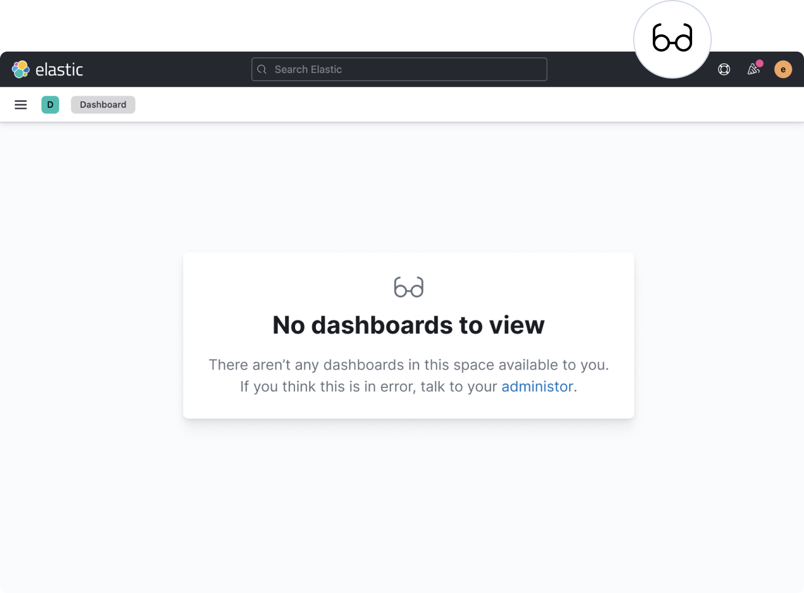
  </Guideline>
  <Guideline type="dont" text="Ambiguous empty states without any actions can feel like an error.">
    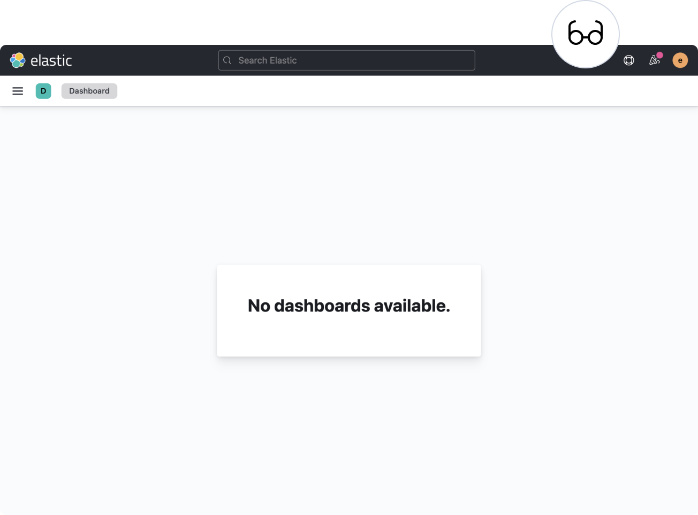
  </Guideline>
</EuiFlexGroup>

### Empty page content that still needs the page header

If necessary, the `EuiPageTemplate.EmptyPrompt` can be still be used alongside `EuiPageTemplate.Header`. Remove any UI that can't be used due to the emptiness.

<EuiFlexGroup gutterSize="m">
  <Guideline type="do" text="Hide unusable elements and utilize the empty state with one or more specific calls to action.">
    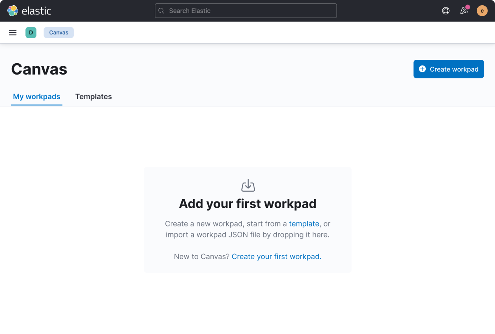
  </Guideline>
  <Guideline type="dont" text="Empty tables with filters that won't find any results and duplicate actions are not necessary.">
    
  </Guideline>
</EuiFlexGroup>

<EuiFlexGroup gutterSize="m">
  <Guideline type="do" text="Use only the empty prompt with explanations and a call to action.">
    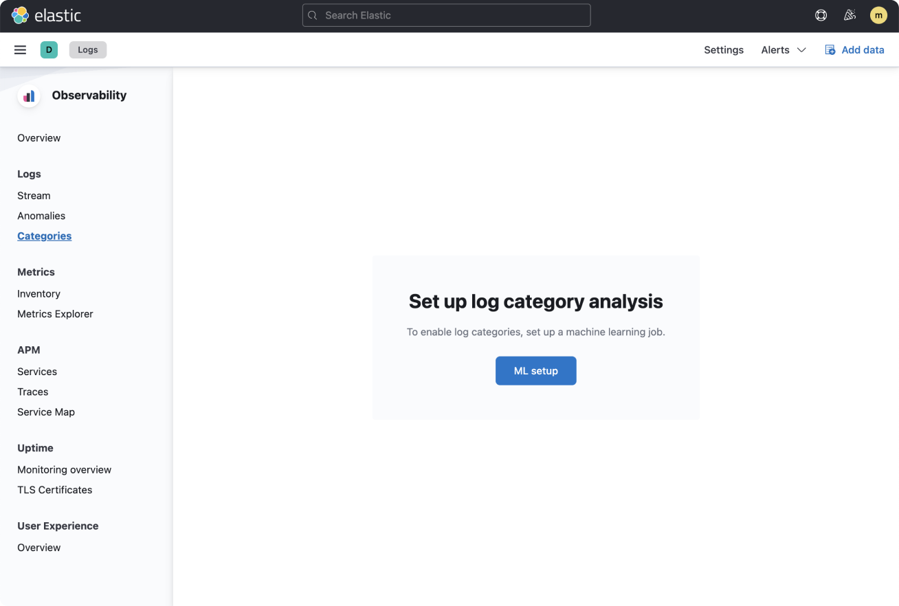
  </Guideline>
  <Guideline type="dont" text="Page headers are not as necessary when the same labelling is used throughout other parts of the page.">
    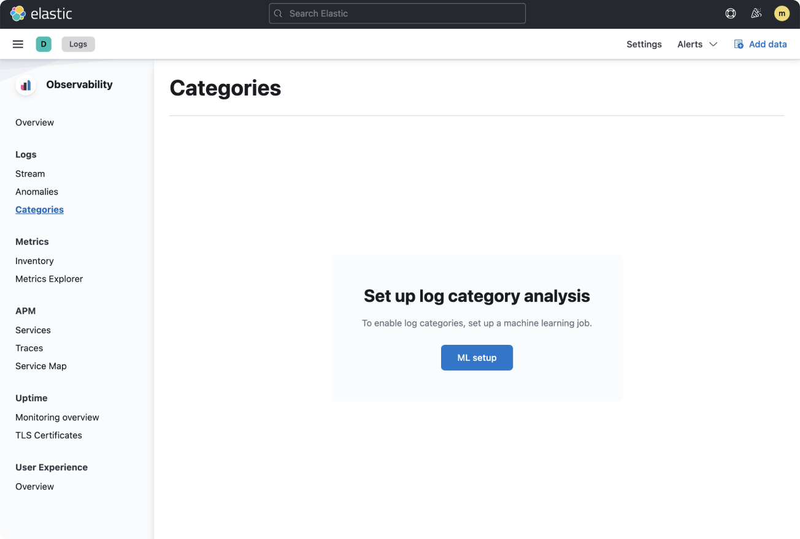
  </Guideline>
</EuiFlexGroup>

## Error and loading states

### When loading the content

If, after loading, the entire page renders as an empty or error state, the loading state should also be an entire page.

<EuiFlexGroup gutterSize="m">
  <Guideline type="do" text="Use the empty prompt as a loading state followed by an empty prompt styled as a error/empty state (or loaded content).">
    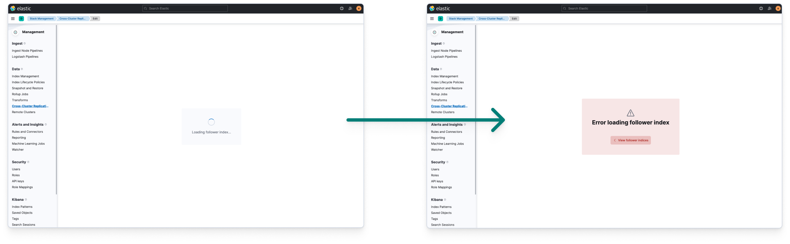
  </Guideline>
  <Guideline type="dont" text="Temporarily showing content like the page headers when loading then removing those elements on error is jarring.">
    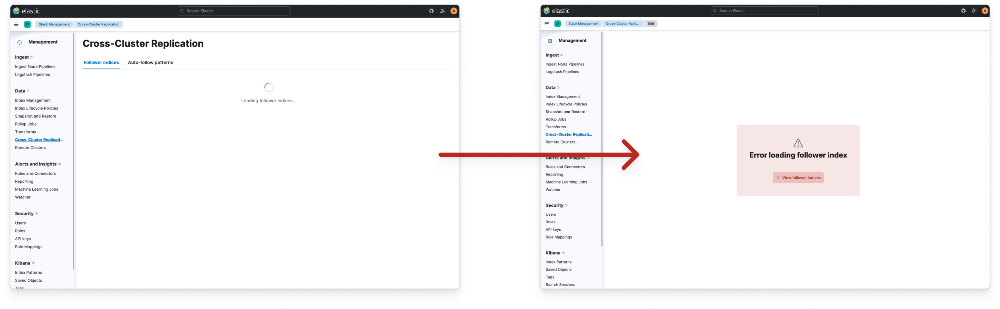
  </Guideline>
</EuiFlexGroup>

### Callouts versus empty prompts

Typically there should only be one EuiPageTemplate.EmptyPrompt when the whole page is empty or an error. They should never be used to stack multiple errors on the same page.

<EuiFlexGroup gutterSize="m">
  <Guideline type="do" text="Use the EuiCallOut components for stacking error messages alongside content.">
    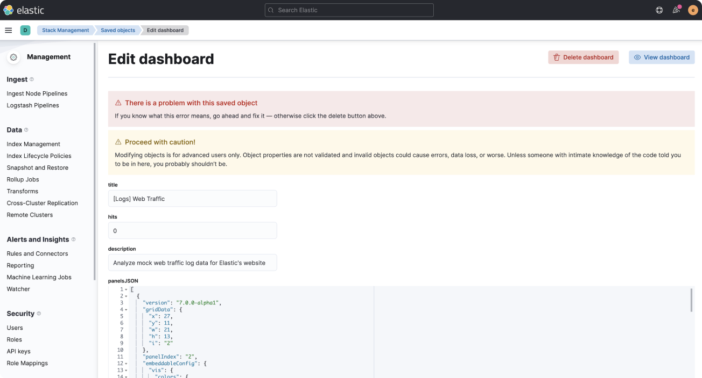
  </Guideline>
  <Guideline type="dont" text="Multiple large empty prompts pushes the main content out of view and, without actions, harms UX.">
    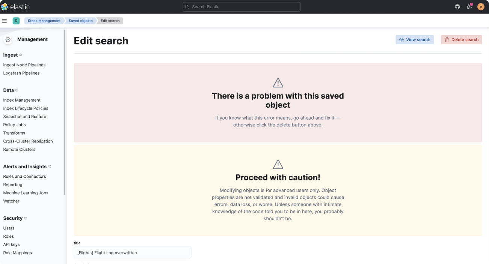
  </Guideline>
</EuiFlexGroup>

### Tabbed content

Treat the page contents under tabs as “full page” content, using empty prompts for empty/loading/error states if it is the only content that is rendered as the tab content. However, the context of the state should dictate whether an empty prompt or simple callout is appropriate.

<EuiFlexGroup gutterSize="m">
  <Guideline type="do" text="If the error blocks all interactions of the tabbed content, a centered empty prompt may be warranted.">
    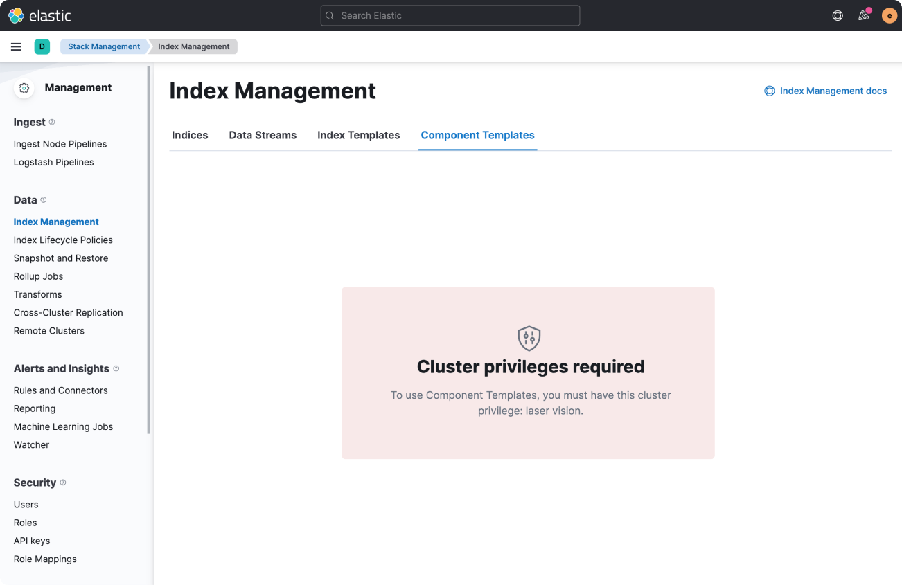
  </Guideline>
  <Guideline type="do" text="If the error is not detrimental or blocking lots of user interaction, a simple callout may suffice. Though this example could also be an empty prompt.">
    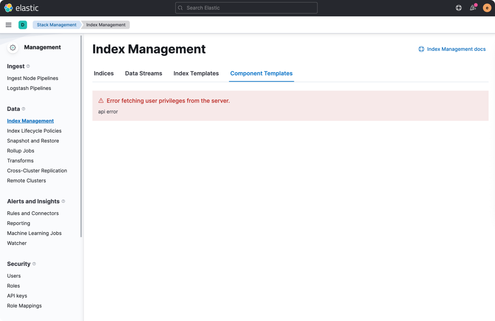
  </Guideline>
</EuiFlexGroup>
