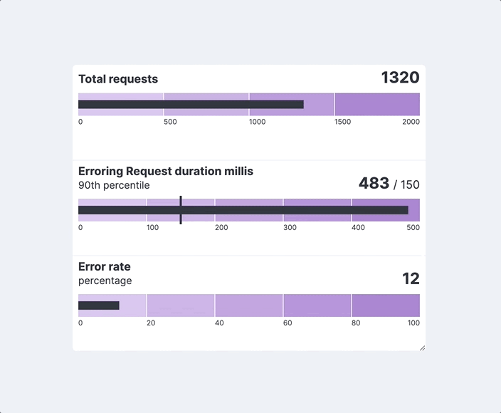

import VersionBadge from './version_badge';

<VersionBadge />

# Elastic Charts as a design system

Elastic Charts ([github repository](https://github.com/elastic/elastic-charts), [storybook](https://elastic.github.io/elastic-charts/?path=/story/annotations-lines--x-continuous-domain&globals=theme:light)) is library of charts, a set of independent components that share a series of common rules in terms of style and behavior.
Moving past the concept of “library”, we consider this list of charts as a “system”, and with that we mean a series of elements that clearly belong to the same design environment, that are consistent with EUI and that are working in a much more cohesive and connected way, depending on each other instead of living on their own.

Please consider that the work described in this page is a long term goal that we are trying to achieve and therefore this material has to be considered a work-in-progress and might not reflect precisely the current state of the library.

---

## Consistency

It might sound simple, even trivial from some points of view, but the most important thing is that all charts should look like they belong to the same system. Charts should behave (link to interaction page) and look similar, there should be an overall shared aesthetic that is consistent among them and with EUI.
If charts, such as any other component, look different from the rest of elements they will be perceived as detached from the product and the whole user experience would be affected, this is why elements within charts follow the same set of rules of positioning, style and interaction.

<FigmaEmbed url="https://www.figma.com/file/aOhpp2CK5tZTGxerdklavR/Elastic-Charts-as-a-Design-System-%5B220%5D?type=design&node-id=1713-24059&mode=design&t=k01qLYeiGwXgx47y-4"
    title="Library consistency."
/>

---

## Style

We consider the concept of style as not purely related to aesthetics. While we obviously know that appearance plays a crucial role in fruition of components, we prefer to approach this topic from the perspective of semantic and hierarchy of information. We focus on how we display information in order to convey meaning and data in a consistent way across the whole set of charts.

### Hierarchy of information

Labels on top of charts are a good example of this concept. Up until 8.11, charts such as pie charts and treemaps have been displaying information in a slightly confusing and conflicting way (left). Reading direction would suggest that the first information we display is the most important, while font-weight in communicating the opposite, giving the values a stronger visual role. The planned design update (right) reinforces these roles being redundant in both position and weight across these two elements.

<FigmaEmbed url="https://www.figma.com/file/aOhpp2CK5tZTGxerdklavR/Elastic-Charts-as-a-Design-System-%5B220%5D?type=design&node-id=2301-2073&mode=design&t=k01qLYeiGwXgx47y-4"
    title="Hierarchy of information."
/>

### Semantic

When representing data, everything should have a meaning and every detail should be carefully considered in order to properly convey information. A good illustration of this approach is how axis labels are positioned next to gridlines consistently across charts.
Labels that describe passage of time (such as timestamps, dates or hours and minutes) are always positioned right next to the gridlines, suggesting that a specific portion of time starts from that specific point and proceeds from that.
Categorical labels (such as the name of a Country, or a specific data series), instead, are always centered on the element in order to directly associate the label with the referred element.

<FigmaEmbed url="https://www.figma.com/file/aOhpp2CK5tZTGxerdklavR/Elastic-Charts-as-a-Design-System-%5B220%5D?type=design&node-id=1732-43337&mode=design&t=k01qLYeiGwXgx47y-4"
    title="Charts semantics."
/>

---

## Titles and labels

Titles and subtitles play a crucial role in describing what the user is supposed to see, they can guide and help our customers in understanding charts and their importance, both visually and semantically, is often underestimated. When too subtle they might disappear from the component failing in delivering information, when too strong they might visually interfere with the overall aesthetic balance being too prominent.

Few typologies of charts (e.g. Metric and Bullet) include, by design, their own title and subtitle while in other cases (e.g. line charts, barchart) that is not required. Both these cases should be consistent and should follow the same rules in order to have a cohesive visual appearance when placed next to each other.

<FigmaEmbed url="https://www.figma.com/file/aOhpp2CK5tZTGxerdklavR/Elastic-Charts-as-a-Design-System-%5B220%5D?type=design&node-id=1732-45544&mode=design&t=k01qLYeiGwXgx47y-4"
    title="titles and labels."
/>

---

## Dependancies among charts

In a system, differently from a library, charts should not live by themselves. The behavior that has been designed for bullet charts is a proof of that.

We are aware that our users might create very small charts and that our charts might be displayed on different monitors in a very wide variety of resolutions. In order to be sure that readability of data is always ensured, we designed a responsive behavior that not only takes in consideration how elements would be displayed within the chart (e.g. see truncation of titles) but also how that whole chart could switch to a simpler and more readable model in case of need.

---

## Multi-purpose charts

In data visualization you can often obtain the same representation with different approaches, or relying on different typologies of charts and the possibility to do that would be a good metric to define the flexibility of a system of charts. The following examples show how we can obtain the same exact representation coming from different starting points, especially when we don’t have a specific solution for a problem.

A good example would be a representation of the health status of a monitored environment, which we represent here with a heatmap and a barchart getting pretty similar results.

<FigmaEmbed url="https://www.figma.com/file/aOhpp2CK5tZTGxerdklavR/Elastic-Charts-as-a-Design-System-%5B220%5D?type=design&node-id=1701-19998&mode=design&t=k01qLYeiGwXgx47y-4"
    title="Multi-purpose charts."
/>

---

## Time Axis

Most of the charts created within the Kibana environment are time-based and therefore we need an advanced way of displaying time so that we can accommodate most of the needs while at the same time providing all information about the context. Our axes are based on a two-levels organization that would provide information about time in a different degree of detail.

A first set of gridlines display the detailed set of time buckets while a higher one would help users understand the context, adding information about years, months or any measure upon that.

Timestamps are also automatically transformed into common ways of writing time such as hours and minutes instead of milliseconds.

<FigmaEmbed url="https://www.figma.com/file/aOhpp2CK5tZTGxerdklavR/Elastic-Charts-as-a-Design-System-%5B220%5D?type=design&node-id=1732-43797&mode=design&t=k01qLYeiGwXgx47y-4"
    title="Time axis."
/>
