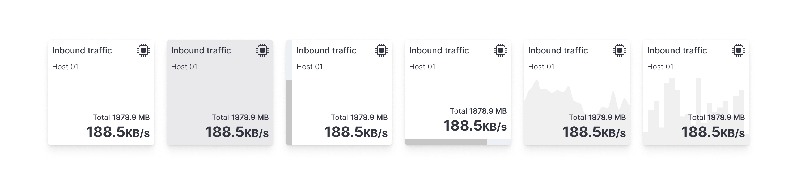
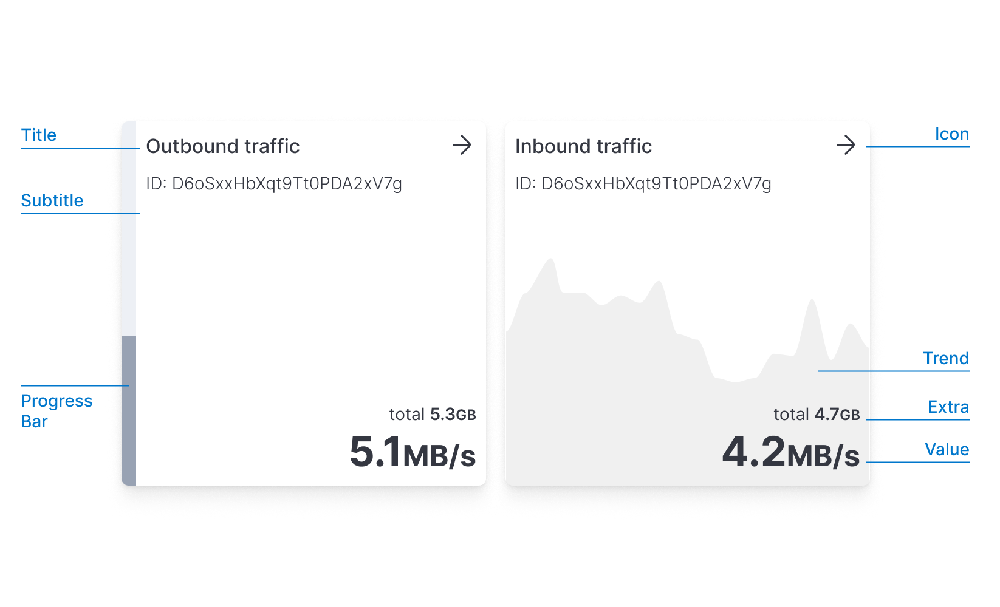

import VersionBadge from '../version_badge';

<VersionBadge />

# Metric chart

```mdx-code-block
import { useChartBaseTheme } from '../use_chart_base_theme';
import * as ElasticCharts from '@elastic/charts';
import BrowserOnly from '@docusaurus/BrowserOnly';
```

The **Metric** chart is a single value visualization available from [Elastic Charts](https://elastic.github.io/elastic-charts). It allows you to represent a metric, a KPI, a specific state with a very simple interface, similar to [**EuiStat**](/docs/display/stat) but with more data visualization oriented capabilities.



## Anatomy



The Metric is used to convey a single numerical value. It usually can represent a specific indicator like: the current CPU value or the number of logs ingested in the last minute. Used correctly, can be very effective represent an overall status.

Some of the questions answered by this chart can be:

*   How many visitors are online now?
*   What's the current usage of CPU and Memory?
*   How many flights have been delayed in the selected time range?

The value can be associated with a secondary visual representation that takes place in the background (like a progress bar or a trend), providing a contextual information layer.

:::note Decorations

These secondary visual representations should be considered decorations. They cannot coexist at the same time (progress bar and trend) to limit the visual complexity and improve the understandability of the data

:::

## When to use

It can convey quantitative information such as plain numbers, counts of elements (visitors, flights, etc), percentages and formulas (sum, average, etc).

A qualitative value can be described through a plain background color, or even better through a progress bar.

When using this chart the used text, title, and subtitles should be clearly described and self-explanatory, try to be specific without being too verbose. Longer text or very precise multi-digit numbers can nullify the scope of the chart. You can use subtitles or Unit Text to clarify this and to inform the user of the choices and calculations that have been made prior.


## Single value

As described above, the Metric can represent just a single value.

A `valueFormatter` is required to format the value.
Is important to limit the number of digits to the right amount depending on your use case. Given a 7 digits number, for example, `$3,364,726`to represent the current company is a detail that can be reserved for tables. In this case, you probably just need to represent the overall magnitude, so reducing it to 4 digits plus a suffix could suffice `$3.365M`.

The `color` attribute can be used to render a color background. Such color can be used for two reasons: aesthetic or functional. In the functional one you can associate a color scale, which depends on your value range, to give a qualitative indicator of your value in that range.

If the passed `value` is a `Number` then you must provide a `valueFormatter`, if instead is a `String` then the `valueFormatter` is not required.

<Demo scope={{ ...ElasticCharts, useChartBaseTheme }}>
  ```tsx
  import React, { useState } from 'react';
  import { EuiFlexGroup, EuiFlexItem, EuiPanel, EuiRange } from '@elastic/eui';
  import { Chart, Metric, Settings } from '@elastic/charts';

  export default () => {
    const chartBaseTheme = useChartBaseTheme();

    const customTicks = [
      { label: '', value: 0 },
      { label: '', value: 1 },
      { label: '', value: 2 },
      { label: '', value: 3 },
      { label: '', value: 4 },
    ];

    const customColorsLevels = [
      {
        min: 0,
        max: 1,
        color: '#a2cb9f',
      },
      {
        min: 1,
        max: 2,
        color: '#a1cbea',
      },
      {
        min: 2,
        max: 3,
        color: '#f2cc8f',
      },
      {
        min: 3,
        max: 4,
        color: '#e07a5f',
      },
      {
        min: 4,
        max: 5,
        color: '#b1130a',
      },
    ];
    const [customColorsValue, setCustomColorsValue] = useState(5 - 3.364726);

    const formatter = new Intl.NumberFormat('en-US', {
      style: 'currency',
      currency: 'USD',
      notation: 'compact',
      maximumFractionDigits: 3,
    });

    return (
      <EuiFlexGroup direction={'column'}>
        <EuiFlexItem grow={0}>
          <EuiPanel paddingSize="none" style={{ overflow: 'hidden', width: 200 }}>
            <Chart size={[200, 200]}>
              <Settings baseTheme={chartBaseTheme} />
              <Metric
                id="1"
                data={[
                  [
                    {
                      color:
                        customColorsValue === 5
                          ? 'white'
                          : customColorsLevels
                              .slice()
                              .reverse()
                              .find((d) => d.min <= customColorsValue)?.color ??
                            'white',
                      title: 'Current Year Revenue',
                      subtitle: 'Rigid.co',
                      extra: (
                        <span>
                          Last year <strong>{formatter.format(1250000)}</strong>
                        </span>
                      ),
                      value:
                        (customColorsValue === 5 ? NaN : 5 - customColorsValue) *
                        1000000,
                      valueFormatter: (v) => formatter.format(v),
                    },
                  ],
                ]}
              />
            </Chart>
          </EuiPanel>
        </EuiFlexItem>
        <EuiFlexItem grow={0}>
          <EuiRange
            value={customColorsValue}
            onChange={(e) => setCustomColorsValue(+e.currentTarget.value)}
            min={0}
            max={5}
            ticks={customTicks}
            levels={customColorsLevels}
            step={0.001}
            aria-label="An example of EuiRange with custom colored indicators"
          />
        </EuiFlexItem>
      </EuiFlexGroup>
    );
  };
  ```
</Demo>

## Progress bar

The metric can also represent a progress or a quantity within a range. This embellishment improves the context and increases the readability of the data.

The length of a bar is one natural representation of progress. To simplify the readability of the length, the bar always starts at **zero**.

:::warning Zero baseline

The zero baseline constraint is a constraint that we already know from bar charts: when the length of the bar is not proportional to the value it represents it becomes hard to discern that quantity. If you are thinking of using a non-zero baseline (not available in the Metric) try to reconsider the problem by considering the bar as the increment/decrement of the value with respect to a non-zero baseline like revenue change from the past year, or how many degrees above the normal body temperature. Consider also that the absence of a visual scale with numerical references makes the bar abstract and should be immediately clear what it represents.

:::

:::warning Negative values

If your metric chart could display negative values (such as temperature, variations in time, YTD losses..) please be aware of this limit and the inner complexity that derives from negative values in such a simple component, please consider adding visual guidance (use an icon to highlight, for instance) to facilitate the user in understanding what is happening.

:::

To use this progress bar, your data should adhere to the `MetricWProgress` type. In particular, in addition to the already required properties you have to specify the maximum value the progress bar can reach through the `domainMax` prop and you have to specify a progress bar direction via `progressBarDirection`.

<Demo scope={{ ...ElasticCharts, useChartBaseTheme }}>
  ```tsx
  import React from 'react';
  import { EuiFlexGroup, EuiFlexItem, EuiPanel } from '@elastic/eui';
  import { Chart, LayoutDirection, Metric, Settings } from '@elastic/charts';

  export default () => {
    const chartBaseTheme = useChartBaseTheme();

    return (
      <EuiFlexGroup gutterSize="l" alignItems="flexStart" direction="row">
        <EuiFlexItem grow={false}>
          <EuiPanel
            paddingSize="none"
            style={{ overflow: 'hidden', width: '200px' }}
          >
            <Chart size={[200, 200]}>
              <Settings baseTheme={chartBaseTheme} />
              <Metric
                id="1"
                data={[
                  [
                    {
                      color: '#A2CB9F',
                      title: 'CPU Usage',
                      subtitle: 'eui.co',
                      value: 34.2,
                      valueFormatter: (v) => `${v}%`,
                      domainMax: 100,
                      progressBarDirection: LayoutDirection.Vertical,
                      extra: (
                        <span>
                          last 10 min <strong>18.3%</strong>
                        </span>
                      ),
                    },
                  ],
                ]}
              />{' '}
            </Chart>
          </EuiPanel>
        </EuiFlexItem>
        <EuiFlexItem grow={false}>
          <EuiPanel
            paddingSize="none"
            style={{ overflow: 'hidden', width: '200px' }}
          >
            <Chart size={[200, 200]}>
              <Settings baseTheme={chartBaseTheme} />
              <Metric
                id="1"
                data={[
                  [
                    {
                      color: '#E07A5F',
                      title: 'CPU Usage',
                      subtitle: 'charts.co',
                      extra: (
                        <span>
                          last 10 min <strong>18.3%</strong>
                        </span>
                      ),
                      value: 74.2,
                      valueFormatter: (v) => `${v}%`,
                      domainMax: 100,
                      progressBarDirection: LayoutDirection.Horizontal,
                    },
                  ],
                ]}
              />
            </Chart>
          </EuiPanel>
        </EuiFlexItem>
      </EuiFlexGroup>
    );
  };
  ```
</Demo>

## Trend

A metric usually represents a statistic of a variable in a time frame. To add a bit more context is possible to represent the trend of that variable over time, by plotting an overlay on the metric background.

To achieve that, the `trend` needs to be filled with an array of objects in the form of `{x: number, y: number}`

The trend is then rendered following these principles:

*   the vertical height represents the range from 0 to the maximum `y` value.
*   the horizontal space represents the range from the minimum to the maximum `x` value
*   the trend height is limited to 50% of the overall Metric height, so the maximum `y` value always touches the vertical middle of the metric chart.

<Demo scope={{ ...ElasticCharts, useChartBaseTheme }}>
  ```tsx
  import React from 'react';
  import { EuiPanel } from '@elastic/eui';
  import { Chart, Metric, Settings } from '@elastic/charts';

  export default () => {
    const chartBaseTheme = useChartBaseTheme();

    const data = Array.from({ length: 30 }).map((d, i) => ({
      x: i,
      y: Math.random() * 1000 + 10000,
    }));

    return (
      <EuiPanel paddingSize="none" style={{ overflow: 'hidden', width: 200 }}>
        <Chart size={[200, 200]}>
          <Settings baseTheme={chartBaseTheme} />
          <Metric
            id="1"
            data={[
              [
                {
                  color: '#6ECCB1',
                  title: 'Number of visitors',
                  subtitle: 'www.eui.co',
                  extra: <span>unique visitors</span>,
                  value: data[data.length - 1].y,
                  valueFormatter: (v) => `${(v / 1000).toFixed(0)}K`,
                  trend: data,
                  trendShape: 'area',
                  trendA11yTitle:
                    'The current number of visitors in the last 10 minutes',
                  trendA11yDescription:
                    'The trend shows a stable number of unique visitors over the last 10 minutes',
                },
              ],
            ]}
          />{' '}
        </Chart>
      </EuiPanel>
    );
  };
  ```
</Demo>

## Multiple metrics

Metric can live alone or be rendered in a grid. To support this, the `data` prop is structured to accept an Array of Arrays representing respectively columns and rows of a grid. In this way you can build:

*   a single row of multiple metrics using `[[{col1}, {col2}, {col3}]]`
*   a single column of multiple metrics using `[[{row1}], [{row2}], [{row3}]]`
*   a grid column ✕ rows of multiple metrics using `[[{col1row1}, {col2row1}], [{col1row2}], [{col2row2}]]`

## Multiple horizontal metrics

Providing the following data structure `data={[[{col1}, {col2}, {col3}]]}`you will get an horizontally aligned set of metrics

You can align vertically the progress bars' directions to compare values using `LayoutDirection.Vertical`

<Demo scope={{ ...ElasticCharts, useChartBaseTheme }}>
  ```tsx
  import React from 'react';
  import { EuiPanel } from '@elastic/eui';
  import { Chart, LayoutDirection, Metric, Settings } from '@elastic/charts';

  export default () => {
    const chartBaseTheme = useChartBaseTheme();

    return (
      <EuiPanel paddingSize="none" style={{ overflow: 'hidden', width: 600 }}>
        <Chart size={[600, 200]}>
          <Settings baseTheme={chartBaseTheme} />
          <Metric
            id="1"
            data={[
              [
                {
                  color: '#F1D86F',
                  title: 'CPU Usage',
                  value: 34.2,
                  domainMax: 100,
                  valueFormatter: (v) => `${v}%`,
                  progressBarDirection: LayoutDirection.Vertical,
                },
                {
                  color: '#FF7E62',
                  title: 'Memory Usage',
                  value: 59.5,
                  domainMax: 100,
                  valueFormatter: (v) => `${v}%`,
                  progressBarDirection: LayoutDirection.Vertical,
                },
                {
                  color: '#6ECCB1',
                  title: 'Swap Usage',
                  value: 21.0,
                  domainMax: 100,
                  valueFormatter: (v) => `${v.toFixed(1)}%`,
                  progressBarDirection: LayoutDirection.Vertical,
                },
              ],
            ]}
          />
        </Chart>
      </EuiPanel>
    );
  };
  ```
</Demo>

## Multiple vertical metrics

Providing the following data structure `data={[[{col1}], [{col2}], [{col3}]]}`you will get an vertically aligned set of metrics

You can align horizontally the progress bars directions to compare values using `LayoutDirection.Horizontal`

<Demo scope={{ ...ElasticCharts, useChartBaseTheme }}>
  ```tsx
  import React from 'react';
  import { EuiPanel } from '@elastic/eui';
  import { Chart, LayoutDirection, Metric, Settings } from '@elastic/charts';

  export default () => {
    const chartBaseTheme = useChartBaseTheme();

    return (
      <EuiPanel paddingSize="none" style={{ overflow: 'hidden', width: 200 }}>
        <Chart size={[200, 400]}>
          <Settings baseTheme={chartBaseTheme} />
          <Metric
            id="1"
            data={[
              [
                {
                  color: '#F1D86F',
                  title: 'CPU Usage',
                  value: 34.2,
                  domainMax: 100,
                  progressBarDirection: LayoutDirection.Horizontal,
                  valueFormatter: (v) => `${v}%`,
                },
              ],
              [
                {
                  color: '#FF7E62',
                  title: 'Memory Usage',
                  value: 59.5,
                  domainMax: 100,
                  progressBarDirection: LayoutDirection.Horizontal,
                  valueFormatter: (v) => `${v}%`,
                },
              ],
              [
                {
                  color: '#6ECCB1',
                  title: 'Swap Usage',
                  value: 21.0,
                  domainMax: 100,
                  progressBarDirection: LayoutDirection.Horizontal,
                  valueFormatter: (v) => `${v.toFixed(1)}%`,
                },
              ],
            ]}
          />
        </Chart>
      </EuiPanel>
    );
  };
  ```
</Demo>

## Grid

You can mix columns and rows in the `data` array to create a grid. The grid is filled with missing tiles to cover the last grid row. If you want to skip a tile, you can pass an `undefined` datum as an element of the array.

Different types of metrics can be mixed together.

<Demo scope={{ ...ElasticCharts, useChartBaseTheme }}>
  ```tsx
  import React from 'react';
  import { EuiIcon, EuiPanel } from '@elastic/eui';
  import { Chart, Metric, MetricSpec, Settings } from '@elastic/charts';

  const osTrend = Array.from({ length: 30 }).map((d, i) => ({
    x: i,
    y: Math.random(),
  }));

  const DATA: MetricSpec['data'] = [
    [
      {
        color: '#3c3c3c',
        title: 'Network eth0',
        subtitle: 'Inbound traffic',
        icon: () => <EuiIcon type={'sortDown'} />,
        value: NaN,
        valueFormatter: (d) => `${d}KBps`,
        trend: osTrend.map((d, i) =>
          i > osTrend.length - 10 ? { x: d.x, y: 0 } : d
        ),
        extra: (
          <span>
            last 10m <b>24KBps</b>
          </span>
        ),
        trendShape: 'area',
        trendA11yTitle: 'The current inbound traffic for the eth0 network',
        trendA11yDescription:
          'The last 10 minutes of inbound traffic for eth0 shows a negative trend',
      },
      {
        color: '#FF7E62',
        title: 'Network eth1',
        subtitle: 'Inbound traffic',
        icon: () => <EuiIcon type={'sortUp'} />,
        value: 33.57,
        extra: (
          <span>
            last 10m <b>23.5KBps</b>
          </span>
        ),
        valueFormatter: (d) => `${d}KBps`,
        trend: osTrend.map((d, i) =>
          i > osTrend.length - 10 ? { x: d.x, y: d.y + 5 } : d
        ),
        trendShape: 'area',
        trendA11yTitle: 'The current inbound traffic for the eth1 network',
        trendA11yDescription:
          'The last 10 minutes of inbound traffic for eth1 shows a positive trend',
      },
      {
        color: '#F1D86F',
        title: 'Network eth2',
        subtitle: 'Inbound traffic',
        icon: () => <EuiIcon type={'grab'} />,
        extra: (
          <span>
            last 10m <b>1.5KBps</b>
          </span>
        ),
        value: 1.57,
        valueFormatter: (d) => `${d}KBps`,
        trend: osTrend.map((d) => ({ x: d.x, y: Math.random() * 0.1 + 5 })),
        trendShape: 'area',
        trendA11yTitle: 'The current inbound traffic for the eth2 network',
        trendA11yDescription:
          'The last 10 minutes of inbound traffic for eth2 shows a stable trend',
      },
    ],
    [
      {
        color: '#6DCCB1',
        title: 'Network eth0',
        subtitle: 'Outbound traffic',
        icon: () => <EuiIcon type={'grab'} />,
        extra: (
          <span>
            last 10m <b>24KBps</b>
          </span>
        ),
        value: 24.85,
        valueFormatter: (d) => `${d}KBps`,
        trend: osTrend.map((d) => ({ x: d.x, y: Math.random() * 0.1 + 3 })),
        trendShape: 'area',
        trendA11yTitle: 'The current outbound traffic for the eth0 network',
        trendA11yDescription:
          'The last 10 minutes of outbound traffic for eth0 shows a stable trend',
      },
      {
        color: '#FFBDAF',
        title: 'Network eth1',
        subtitle: 'Outbound traffic',
        extra: (
          <span>
            last 10m <b>32KBps</b>
          </span>
        ),
        icon: () => <EuiIcon type={'sortUp'} />,
        value: 1.2,
        valueFormatter: (d) => `${d}MBps`,
        trend: osTrend.map((d, i) =>
          i > osTrend.length - 10 ? { x: d.x, y: d.y + 2 } : d
        ),
        trendShape: 'area',
        trendA11yTitle: 'The current outbound traffic for the eth1 network',
        trendA11yDescription:
          'The last 10 minutes of outbound traffic for eth1 shows a positive trend',
      },
      {
        color: '#F1D86F',
        title: 'Network eth2',
        subtitle: 'Outbound traffic',
        extra: (
          <span>
            last 10m <b>50KBps</b>
          </span>
        ),
        icon: () => <EuiIcon type={'sortDown'} />,
        value: 23.21,
        valueFormatter: (d) => `${d}KBps`,
        trend: osTrend.map((d, i) =>
          i > osTrend.length - 10 ? { x: d.x, y: Math.random() * 0.2 } : d
        ),
        trendShape: 'area',
        trendA11yTitle: 'The current outbound traffic for the eth2 network',
        trendA11yDescription:
          'The last 10 minutes of outbound traffic for eth2 shows a negative trend',
      },
    ],
  ];

  export default () => {
    const chartBaseTheme = useChartBaseTheme();
    return (
      <EuiPanel paddingSize="none" style={{ overflow: 'hidden', width: 800 }}>
        <Chart size={[800, 300]}>
          <Settings baseTheme={chartBaseTheme} />
          <Metric id="1" data={DATA} />
        </Chart>
      </EuiPanel>
    );
  };
  ```
</Demo>

## Resizing

The Metric chart will take the parent `height` or `width` if those are fixed. If not you can still specify a fixed size for the component by constraining the size from the `Chart` component.

There is **no minimum size** for this component even though since font sizes do not scale according to size but only according to specific breakpoints, you might encounter a few problems if you work with large numbers at really small sizes.

Metric charts are composed of a series of elements that follow a specified hierarchy. When resizing vertically, it might occur that there is not enough room to place all of them within the component. If that happens, automatically these elements get hidden starting from the least important to the most important. `title` and `value` will never be hidden.

Below certain breakpoints, secondary elements such as `subtitles` are removed in order to leave as much space as possible for primary elements (`title`, `value`). Be aware of this limitation when dealing with small metrics.

:::warning
Please be always aware of this limit and resize the Metric component accordingly within your interface or dashboard.
:::

```mdx-code-block
import { MetricChartResizing } from './metric_chart_resizing';
```

<BrowserOnly>
  {() => <MetricChartResizing />}
</BrowserOnly>

## No Data

Various situations could lead to an uncertain state. We designed two **empty states** that should cover most of those cases:

*   When an applied filter makes the metric incomputable (missing values in a windowed function, or filtered out values for a percentage calculation), then a `NaN` can be sent as the `value`. This will result in rendering a `N/A` string, making clear that the chart is working but is not possible to compute the metric correctly.
*   If, instead, the metric itself is filtered out (for example the metric represents a specific category, that is filtered out) the component won't be rendered, and an empty box is rendered.

```mdx-code-block
import { MetricChartNoData } from './metric_chart_no_data';
```

<BrowserOnly>
  {() => <MetricChartNoData />}
</BrowserOnly>

## Alternatives and similarities

Don't rely solely on the background trend-line to provide a precise and understandable analysis of data trends. These options give a contextual and wider layer of information that could help in understanding the overall trends and evolution of data but they are not detailed enough to get specific insights.

If your goal is to precisely see the evolution of values over time please use a line chart instead, where you'll have all the information required to perform a proper analysis (grid, values, axis, legend, etc)

If the values displayed are the result of any kind of filter and they do not reflect the current timeframe selected on your dashboard, please remember to make this explicit. You can use subtitles or Unit Text to clarify this and to inform the user of the choices and calculations that have been made prior.

1.  **Bullet Chart**: A more complex version of the Metric Chart which provides additional features to display values more technically and exhaustively.
2.  **Barchart**: When many indicators/metrics share the same scale (e.g. percentage) it's better to put them on the same chart in order to simplify the comparison among them.
3.  **Table**: Tables offer the possibility to sort and handle data in a more detailed manner. Use tables with conditional formatting to obtain a similar result but with more controls.
4.  **Plain Text**: Within your dashboards, use plain text with a dedicated box when a long explanation is needed. The Metric chart has limitations in terms of component size and length of text, instead of abounding with text, switch to a simpler component such as plain text.
