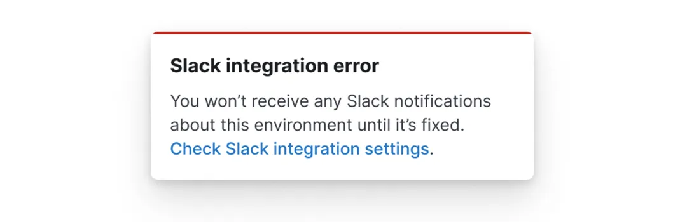

# Error warning

Error warnings are used to tell users about unrelated errors in another part of the application, or a third party service.

## When to use this pattern
Error warnings are used to tell users about unrelated errors in another part of the application, or a third party service. They do not block the user from completing the current task.

An unrelated error should be non-intrusive, but the user should still be told so they can make an informed decision on whether to continue or not.

Example:
> **Slack integration error**
> You won’t receive any Slack notifications about this environment until it’s fixed.

## When not to use this pattern

Do not use an error warning when the error is directly related to the current task. Instead, use the [error page pattern](./error-page.mdx) or the [error banner pattern](./error-banners.mdx#error-banner).

Do not use an error warning for validating information the user has entered, instead use the [validation errors pattern](./error-validation.mdx).

## How it works

Use the [EuiToast](../../components/display/toast/index.mdx#danger) component, with the props:
- `color="danger"`
- `iconType="alert"`

Use the `title` prop to tell the user what went wrong, and `
` tags to add any additional context.

## Help improve this pattern

To help make sure that this page is useful, relevant and up to date, you can join our [#ux&#8209;wg&#8209;patterns](https://elastic.slack.com/archives/C049ADQE99S) discussions on Slack.
