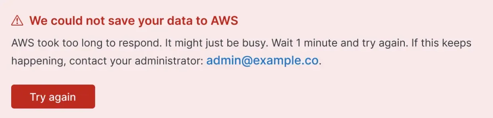

# Error banner
description: Use an error banner when something’s gone wrong, but it’s still possible to show the user the page they expected to see.

## When to use this pattern

Use an error banner when something’s gone wrong, but it’s still possible to show the user the page they expected to see.

## When not to use this pattern

Do not use an error banner to display a warning about an unrelated error, instead use the [error warning pattern](./error_warning.mdx).

Do not use an error banner for validating information the user has entered, instead use the [validation errors pattern](./error_validation.mdx).

Do not use an error banner when you're unable to show the page the user was expecting, instead use the [error page pattern](./error_pages.mdx).

## How it works
Error banners must be highly visible. Use the [EuiCallout](../../../components/callout) component, and the props:
- `color="danger"`
- `iconType="alert"`

Use the title prop to explain the [problem](./error_writing.mdx).

Use paragraphs to explain the [cause](./error_writing.mdx) and the [recommendation](./error_writing.mdx).

Use a button if there is an obvious action the user can take, like ‘try again’.

## Help improve this pattern

To help make sure that this page is useful, relevant and up to date, you can join our [#ux&#8209;wg&#8209;patterns](https://elastic.slack.com/archives/C049ADQE99S) discussions on Slack.