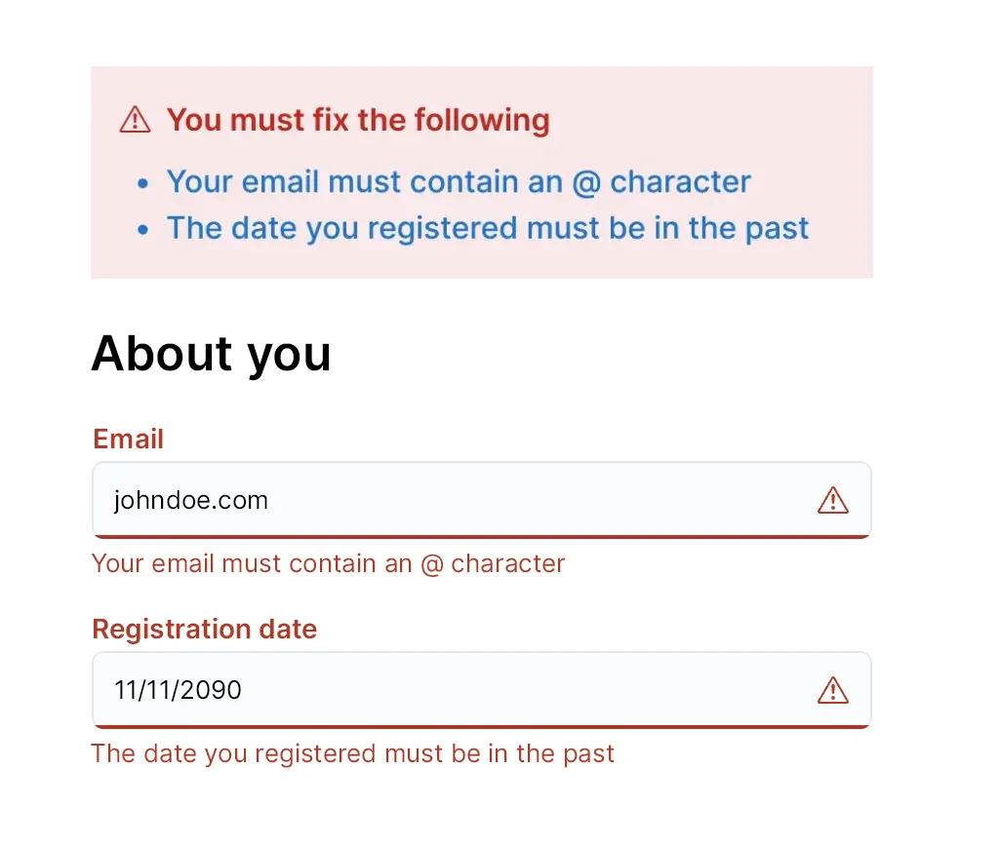
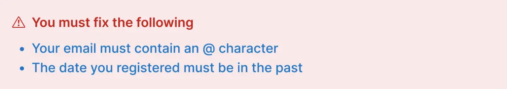
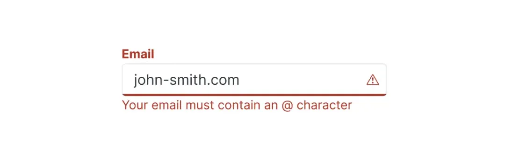

# Validation errors
Use validation errors when the user enters information in a different format than what the system expects.

## When to use this pattern
Validation errors should be shown when the user enters information in a different format than what the system expects. The user must fix them before they can continue.

For example:
- leaving a text box empty
- a typo, such as forgetting the ‘@’ symbol in an email address
- not selecting an option from a list of checkboxes

## When not to use this pattern
Do not use a validation error for any kind of error other than user input.

Instead, use one of the following:
- [error page pattern](./error_pages.mdx)
- [error banner pattern](./error_banners.mdx)
- [error warning pattern](./error_warning.mdx)

## How it works
There are several steps to creating a good user experience for validation errors.

1. Display an error summary explaining the issues
2. Link to the fields which caused the errors
3. Highlight the fields which caused the errors
4. Explain how to fix each field

### Error summary
Error summaries must be highly visible. Use the [EuiCallout](../../../components/callout) component, and the props:
- `color="danger"`
- `iconType="alert"`

In the callout:
- inform the user there are errors they need to fix
- list all the things they need to fix
- link the explanations to the correct field using it’s ID

Example:

### Text inputs
Use the [EuiFieldText](../../components/forms/form_controls/overview.mdx#text-field) component and the prop `isInvalid=true` render the error styles.

Use the [errors prop](../../components/forms/form_controls/overview.mdx#text-field) to display the error message alongside the field. Make sure the error message on the field matches the error message in the summary, so it’s obvious which field caused which error.

## Help improve this pattern

To help make sure that this page is useful, relevant and up to date, you can join our [#ux&#8209;wg&#8209;patterns](https://elastic.slack.com/archives/C049ADQE99S) discussions on Slack.
