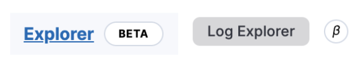

# Pre-GA badges

Using badges in the interface allows to indicate upcoming features and product innovations available for testing and to set user expectations about the maturity, (non-)support, and stability of a feature.

## Choosing between designations

When a feature becomes available for users before being officially Generally Available (GA), it is marked using a badge. A badge can have a default and a short form (with a simple icon). With both forms, a tooltip text explains what this means for the feature to help users get the correct expectations.

Features don't necessarily go through each stage defined in this document. For example, it can start with Beta, or it can start with Technical preview and be announced as GA next.

Such badges rely on the [Beta badge EUI component](../components/display/badge/beta_badge.mdx).

| Stage | Technical preview | Beta | GA |
| ---- | ---- | ---- | ---- |
| Description | Experimental features that may not be kept or that may change fundamentally.  | Features nearing GA that are not expected to fundamentally change for GA. | Features that are officially supported for production usage. |
| Default label | `TECHNICAL PREVIEW`  | `BETA` | N/A |
| Short label  _For navigation and contextual menus_| <Icon type="beaker" title="Technical preview beaker icon" />  | <Icon type="beta" title="beta icon" /> | N/A |
| Tooltip | `This functionality is experimental and not supported. It may change or be removed at any time.`  | `This functionality is still under development and not ready for production usage.`| N/A |
| User expectations and perception | Unstable. For testing an innovation. Bugs and breaking changes are perceived as normal. | Fairly stable. For evaluating or testing an awaited feature. The feature is **almost** ready. There might be some bugs and UX/API refinements. | Production-ready. The feature is ready for production workloads. |

<FigmaEmbed url="https://www.figma.com/file/cfQrOpBdUoY5ygigVRwy7N/Release-badges?type=design&node-id=701-4062&mode=design&t=P3UOCVz5MKA8YJyN-0" title="Showing beta and preview badges in the UI" />

