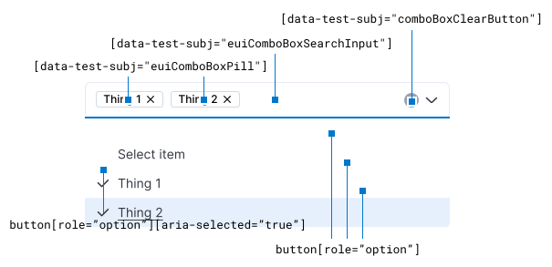

## Available selectors

| Selector                                      | Description                   |
|-----------------------------------------------|-------------------------------|
| `[data-test-subj="euiComboBoxPill"]`          | Selected elements (pills)     |
| `[data-test-subj="comboBoxSearchInput"]`      | Search input                  |
| `[data-test-subj="comboBoxClearButton"]`      | Clear selection button        |
| `[data-test-subj="comboBoxToggleListButton"]` | Toggle list of options button |
| `[data-test-subj=”comboBoxOptionsList”]`      | Options list                  |
| `[role=”option”]`                             | Options list items            |
| `[role=”option”][aria-selected=”true”]`       | Selected options list items   |

## Notes

* Single selection components render selected value as the input `value` attribute instead of pills.
