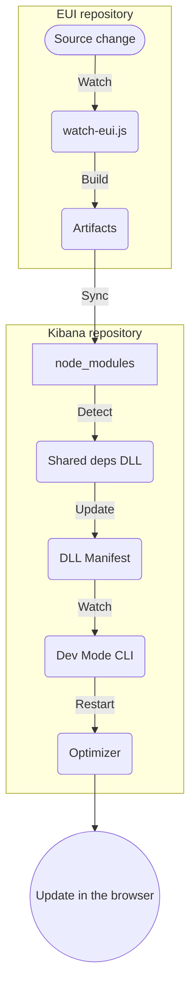

# Developing EUI locally in Kibana

This guide explains how to develop EUI library locally while seeing changes reflected in a local Kibana instance.

## Prerequisites

- You have this repository forked and cloned:
  ```bash
  git clone https://github.com/<your-username>/eui.git
  cd eui
  nvm use
  yarn
  ```
- You have [Kibana repository](https://github.com/elastic/kibana) forked and cloned:
  ```bash
  git clone https://github.com/<your-username>/kibana.git
  cd kibana
  nvm use
  yarn kbn bootstrap
  ```
- (Optional) EUI and Kibana should be sibling directories for simplest DX:
  ```text
  Projects/
  ├── eui/
  └── kibana/
  ```

## Usage

### In Kibana

In the [Kibana](https://github.com/elastic/kibana) repository root, open terminal and run:

```bash
yarn kbn bootstrap
yarn es snapshot --license trial
```

Then, run the `@kbn/ui-shared-deps-npm` watcher:

```bash
npx moon run @kbn/ui-shared-deps-npm:watch-webpack
```

Finally, run the Kibana server:

```bash
yarn start --no-cache
```

### In EUI

In the **EUI** repository root, run:

```bash
# Watch all packages and sync to Kibana
yarn watch --kibana
# Shortcut:
yarn watch -k
```

or if you want to watch a specific EUI package run:

```bash
# Watch only @elastic/eui
yarn watch --kibana --package @elastic/eui
# Shortcuts:
yarn watch -k -p @elastic/eui

# Watch only @elastic/eui-theme-borealis
yarn watch --kibana --package @elastic/eui-theme-borealis
# Shortcuts:
yarn watch -k -p @elastic/eui-theme-borealis

# Watch only @elastic/eui-theme-common
yarn watch --kibana --package @elastic/eui-theme-common
# Shortcuts:
yarn watch -k -p @elastic/eui-theme-common
```

If your Kibana directory is located elsewhere, you can configure the directory path:

```bash
yarn watch --kibana-dir=/path/to/kibana
# Shortcut:
yarn watch -d /path/to/kibana
```

These commands will:

1. Watch for changes in the selected package(s).
2. Compile the changed package(s).
3. Sync the build artifacts directly into the Kibana directory, by default: `../kibana/node_modules`.

## How it works

The integration relies on a chain of file watchers and build triggers to propagate changes from EUI source code to the browser running Kibana.

### Data flow

1. The script watches `src` directories using `chokidar`.
2. Changed packages are rebuilt using their respective build commands.
3. Build artifacts are copied to Kibana's `node_modules` using `fs.cp`.
4. The script "touches" the `package.json` in the destination to notify Kibana's watcher.
5. Webpack detects the change and rebuilds `@kbn/ui-shared-deps-npm.dll.js`.
6. The `@kbn/cli-dev-mode` detects the new DLL and restarts the **Optimizer**.
7. When the optimizer has rebuilt all plugins, the browser window can be refreshed.

### Architecture diagram



## Troubleshooting

- **Change not showing up?**

Check the terminal output of the EUI watcher. If the `node_modules` propagation succeeded, check the Kibana terminal for "restarting optimizer". Ensure the `--kibana` (or `-k`) flag is present.

- **Slow feedback loop?**

The process involves two builds (EUI build + Kibana DLL build) and an Optimizer restart. This can typically take up to 2 minutes.

To make the EUI build process faster, you can omit generating type declaration file:

```bash
yarn watch --no-declarations
```
