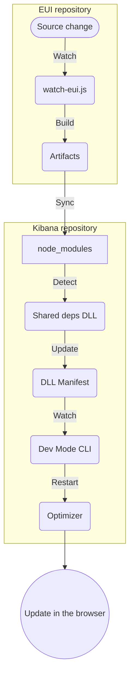

# Developing EUI locally in Kibana

This guide explains how to develop EUI library locally while seeing changes reflected in a local Kibana instance.

> [!TIP]
> This is the workflow for **rapid local development** — a custom watcher rebuilds EUI packages and syncs them into your local Kibana's `node_modules` as you edit. To validate your EUI changes against **Kibana CI** (in a Kibana draft PR), use `yarn build-pack` instead — see [Testing EUI features in Kibana](../testing/testing-in-kibana.md).

## Prerequisites

- You have this repository forked and cloned:
  ```bash
  git clone https://github.com/<your-username>/eui.git
  cd eui
  nvm use
  yarn
  ```
- You have [Kibana repository](https://github.com/elastic/kibana) forked and cloned:
  ```bash
  git clone https://github.com/<your-username>/kibana.git
  cd kibana
  nvm use
  corepack enable
  corepack prepare pnpm@$(node -pe "require('./package.json').engines.pnpm.replace(/^\D*/, '')") --activate
  yarn kbn bootstrap
  ```
- (Optional) EUI and Kibana should be sibling directories for simplest DX:
  ```text
  Projects/
  ├── eui/
  └── kibana/
  ```

## Usage

### In Kibana

In the [Kibana](https://github.com/elastic/kibana) repository root, open terminal and start Elasticsearch:

```bash
yarn es snapshot --license trial
```

Then, run the `@kbn/ui-shared-deps-npm` watcher:

```bash
npx moon run @kbn/ui-shared-deps-npm:watch-webpack
```

Finally, run the Kibana server:

```bash
yarn start --no-cache
```

### In EUI

In the **EUI** repository root, run:

```bash
# Watch all packages and sync to Kibana
yarn watch --kibana
# Shortcut:
yarn watch -k
```

or if you want to watch a specific EUI package run:

```bash
# Watch only @elastic/eui
yarn watch --kibana --package @elastic/eui
# Shortcuts:
yarn watch -k -p @elastic/eui

# Watch only @elastic/eui-theme-borealis
yarn watch --kibana --package @elastic/eui-theme-borealis
# Shortcuts:
yarn watch -k -p @elastic/eui-theme-borealis

# Watch only @elastic/eui-theme-common
yarn watch --kibana --package @elastic/eui-theme-common
# Shortcuts:
yarn watch -k -p @elastic/eui-theme-common
```

If your Kibana directory is located elsewhere, you can configure the directory path:

```bash
yarn watch --kibana-dir=/path/to/kibana
# Shortcut:
yarn watch -d /path/to/kibana
```

These commands will:

1. Watch for changes in the selected package(s).
2. Compile the changed package(s). With `--kibana`, `@elastic/eui` initially compiles `optimize/es` only (Kibana's alias), then incrementally compiles changed files.
3. Sync the build artifacts into the Kibana directory, by default: `../kibana/node_modules`.

## How it works

The integration relies on a chain of file watchers and build triggers to propagate changes from EUI source code to the browser running Kibana.

### Data flow

1. The script watches `src` directories using `chokidar`.
2. With `--kibana`, `@elastic/eui` runs one complete `build:optimize-es`, then Babel-compiles only changed source files. Changed JSON and SVG files are copied directly.
3. `@elastic/eui` syncs only changed `optimize/es` files into Kibana's `node_modules` and touches `package.json` once per batch. Theme packages still rebuild and copy their full `files` list.
4. Webpack detects the change and rebuilds `@kbn/ui-shared-deps-npm.dll.js`.
5. The `@kbn/cli-dev-mode` detects the new DLL and restarts the **Optimizer**.
6. When the optimizer has rebuilt all plugins, the browser window can be refreshed.

### Architecture diagram


```mermaid
flowchart TD
    %% EUI
    subgraph EUI [EUI repository]
        Change([Source change]) --> |Watch| Script(watch-eui.js)
        Script --> |Build| Artifacts(Artifacts)
    end

    Artifacts --> |Sync| NodeModules[node_modules]

    %% Kibana
    subgraph Kibana [Kibana repository]
        NodeModules --> |Detect| Webpack(Shared deps DLL)
        Webpack --> |Update| Manifest(DLL Manifest)
        Manifest --> |Watch| CLI(Dev Mode CLI)
        CLI --> |Restart| Optimizer(Optimizer)
    end

    Optimizer --> Browser((Update in the browser))
```

## Troubleshooting

- **Change not showing up?**

Check the terminal output of the EUI watcher. If the `node_modules` propagation succeeded, check the Kibana terminal for "restarting optimizer". Ensure the `--kibana` (or `-k`) flag is present.

- **Slow feedback loop?**

With `--kibana`, `@elastic/eui` skips `lib/`, `es/`, types, and the rest of the package build. After the initial `optimize/es` build, only changed files are compiled. Most of the remaining feedback time is Kibana's DLL and optimizer.

`yarn watch` without `--kibana`, and theme packages, still run a full build. For those, you can omit generating type declaration files:

```bash
yarn watch --no-declarations
```
