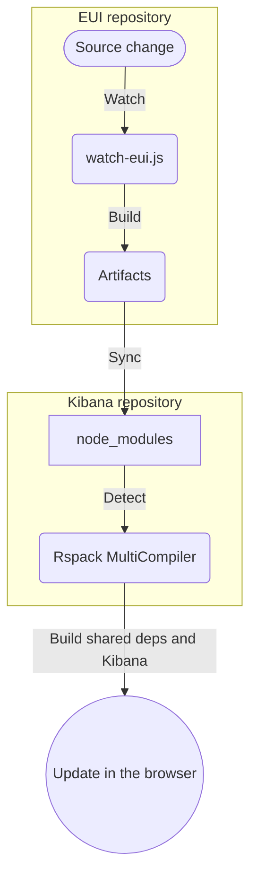

# Developing EUI locally in Kibana

This guide explains how to develop EUI library locally while seeing changes reflected in a local Kibana instance.

> [!TIP]
> This is the workflow for **rapid local development** — a custom watcher rebuilds EUI packages and syncs them into your local Kibana's `node_modules` as you edit. To validate your EUI changes against **Kibana CI** (in a Kibana draft PR), use `yarn build-pack` instead — see [Testing EUI features in Kibana](../testing/testing-in-kibana.md).

## Prerequisites

- You have this repository forked and cloned:
  ```bash
  git clone https://github.com/<your-username>/eui.git
  cd eui
  nvm use
  yarn
  ```
- You have [Kibana repository](https://github.com/elastic/kibana) forked and cloned:
  ```bash
  git clone https://github.com/<your-username>/kibana.git
  cd kibana
  nvm use
  corepack enable
  corepack prepare pnpm@$(node -pe "require('./package.json').engines.pnpm.replace(/^\D*/, '')") --activate
  pnpm kbn bootstrap
  ```
- (Optional) EUI and Kibana should be sibling directories for simplest DX:
  ```text
  Projects/
  ├── eui/
  └── kibana/
  ```

## Usage

### Start Kibana from EUI

In the **EUI** repository root, run the Kibana processes in one terminal:

```bash
yarn watch:kibana
```

This starts the EUI watcher, then starts Elasticsearch and Kibana after the initial EUI build. Kibana's Rspack MultiCompiler watches the synced EUI output and rebuilds the affected shared and Kibana bundles. Press `Ctrl+C` to stop all managed processes.

If Elasticsearch already uses port `9200`, or Kibana uses port `5601`, the corresponding process is not started.

If your Kibana directory is located elsewhere:

```bash
yarn watch:kibana --kibana-dir=/path/to/kibana
# Shortcut:
yarn watch:kibana -d /path/to/kibana
```

To watch only one EUI package:

```bash
yarn watch:kibana --package @elastic/eui
# Shortcut:
yarn watch:kibana -p @elastic/eui
```

## How it works

The integration relies on a chain of file watchers and build triggers to propagate changes from EUI source code to the browser running Kibana.

### Data flow

1. The script watches `src` directories using `chokidar`.
2. With `--kibana`, `@elastic/eui` runs one complete `build:optimize-es`, then Babel-compiles only changed source files. Changed JSON and SVG files are copied directly.
3. `@elastic/eui` syncs only changed `optimize/es` files into Kibana's `node_modules` and touches `package.json` once per batch. Theme packages still rebuild and copy their full `files` list.
4. Kibana's Rspack MultiCompiler detects the change and rebuilds shared dependencies before rebuilding Kibana.
5. When Rspack has rebuilt, the browser reloads.

### Architecture diagram


```mermaid
flowchart TD
    %% EUI
    subgraph EUI [EUI repository]
        Change([Source change]) --> |Watch| Script(watch-eui.js)
        Script --> |Build| Artifacts(Artifacts)
    end

    Artifacts --> |Sync| NodeModules[node_modules]

    %% Kibana
    subgraph Kibana [Kibana repository]
        NodeModules --> |Detect| Rspack(Rspack MultiCompiler)
    end

    Rspack --> |Build shared deps and Kibana| Browser((Update in the browser))
```

## Troubleshooting

- **Change not showing up?**

Check the terminal output of the EUI watcher. If the `node_modules` propagation succeeded, check the Kibana terminal for Rspack rebuild output. Ensure you started the workflow with `yarn watch:kibana`.

- **Slow feedback loop?**

For `@elastic/eui`, the watcher skips `lib/`, `es/`, types and the rest of the package build. After the initial `optimize/es` build, only changed files are compiled. Theme packages still run a full build. Most of the remaining feedback time is Kibana's Rspack rebuild.
