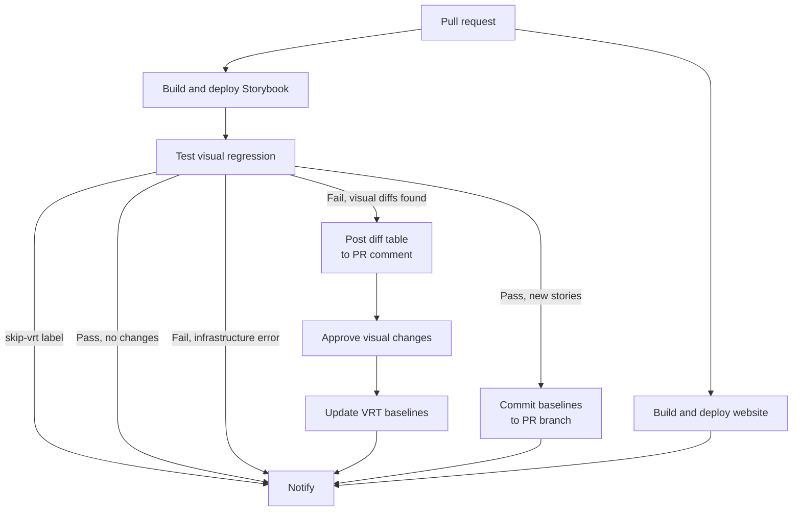

# Visual regression testing

EUI uses [Playwright Test Runner](https://playwright.dev/) with [`jest-image-snapshot`](https://github.com/americanexpress/jest-image-snapshot) for component visual regression testing. Tests run against a live Storybook instance and compare screenshots of stories against previously approved reference images.

Visual regression tests run automatically on every pull request against the deployed Storybook preview. When differences are found, a diff table is posted as a PR comment and a Buildkite block step appears for human approval before baselines are updated.

## Running VRT locally

Make sure you have [Docker](https://docs.docker.com/get-docker/) installed and running. It's used to take screenshots in a Linux environment matching CI.

Start a local Storybook server:

```shell
yarn storybook --no-open
```

Run the visual regression tests:

```shell
yarn workspace @elastic/eui test-visual-regression
```

To test against a specific URL (e.g. a deployed PR preview):

```shell
yarn workspace @elastic/eui test-visual-regression -- --url https://eui.elastic.co/pr_1234/storybook
```

## Updating baseline screenshots

```shell
# Update all baselines
yarn workspace @elastic/eui test-visual-regression update

# Update baselines against a specific URL
yarn workspace @elastic/eui test-visual-regression update -- --url https://eui.elastic.co/pr_1234/storybook
```

Reference images are stored in `packages/eui/.vrt/reference/`.

## Variants

Each story is snapshotted under multiple **variants** to catch e.g. responsive-layout regressions. Every variant produces its own baseline file, suffixed with the variant name:

    packages/eui/.vrt/reference/
      navigation-euibutton--playground-desktop.png
      navigation-euibutton--playground-mobile.png

The test-runner is invoked once per variant (similar to [Playwright projects](https://playwright.dev/docs/test-projects)), so each variant runs in its own process and browser context with the viewport applied before the story renders. Variants are defined in the `VARIANTS` map in [`.storybook/vrt.ts`](https://github.com/elastic/eui/tree/main/packages/eui/.storybook/vrt.ts); [`scripts/test-visual-regression.js`](https://github.com/elastic/eui/tree/main/packages/eui/scripts/test-visual-regression.js) selects the active one per run using the `VRT_VARIANT` environment variable.

Current variants:

| Variant | Viewport |
|---|---|
| `desktop` | 1440 × 900 |
| `mobile` | 390 × 844 |

### Skipping specific variants

If a story can't render correctly under a particular variant, opt out of just that variant by passing an array to `parameters.vrt.skip` (see [Skipping stories](#skipping-stories)). The story still runs under the remaining variants.

## Filtering stories

Pass any [`test-storybook`](https://storybook.js.org/docs/writing-tests/test-runner) flags after `--`:

```shell
# Only run stories with a specific tag
yarn workspace @elastic/eui test-visual-regression -- --includeTags vrt-only

# Exclude stories with a tag
yarn workspace @elastic/eui test-visual-regression -- --excludeTags skip-vrt
```

## Skipping stories

Set `parameters.vrt.skip` to opt a story out of VRT. Leave a comment explaining why.

- `skip: true` skips the story under **all** variants.
- `skip: ['mobile']` skips only the listed variants; the story still runs under the rest.

```tsx
export const MyStory: Story = {
  parameters: {
    vrt: {
      // Skipped: this story is interaction-only, not a visual state
      skip: true,
    },
  },
};

export const MobileUnsupported: Story = {
  parameters: {
    vrt: {
      // Skipped on mobile: the toolbar control is hidden below this breakpoint
      skip: ['mobile'],
    },
  },
};
```

Skipping a variant also skips the story's `play` body for that variant, so e.g. interactions don't run at a viewport the story isn't built for.

When you add `vrt.skip` to a story that previously had a baseline, manually delete the affected snapshot files from `packages/eui/.vrt/reference/` (all variants for `true` or just the listed ones for an array).

## Using non-default selectors

By default the test runner screenshots `#story-wrapper > *`. For components that render outside the story wrapper (portals, popovers, dropdowns) specify a custom selector in `parameters.vrt.selector`.

Predefined selectors are exported from [`.storybook/vrt.ts`](https://github.com/elastic/eui/tree/main/packages/eui/.storybook/vrt.ts):

```tsx
import { VRT_SELECTORS } from '../../../.storybook/vrt';

export const Open: Story = {
  parameters: {
    vrt: {
      selector: VRT_SELECTORS.portal,
    },
  },
};
```

Available selectors:

| Selector | Value | Use case |
|---|---|---|
| `VRT_SELECTORS.default` | `#story-wrapper > *` | Default (no need to set) |
| `VRT_SELECTORS.textOnly` | `#story-wrapper` | Components rendering a text node |
| `VRT_SELECTORS.portal` | `page` | Portalled elements (popover, tooltip, dropdown); takes a full-page screenshot |

## Using interactions for specific states

Wrap play functions with `playDecorator` when they need to reach elements outside the story wrapper (e.g. portals). It injects `bodyElement` (`document.body`) into the context so `within(bodyElement)` can query portal content.

```tsx
import { userEvent, waitFor, within, expect } from '@storybook/test';
import { VRT_SELECTORS, playDecorator } from '../../../.storybook/vrt';

export const OpenDropdown: Story = {
  parameters: {
    vrt: { selector: VRT_SELECTORS.portal },
  },
  play: playDecorator(async (context) => {
    const { canvasElement, bodyElement } = context;

    // canvasElement: content inside the story wrapper
    const canvas = within(canvasElement);
    // bodyElement: use this to reach portalled elements
    const body = within(bodyElement);

    await userEvent.click(canvas.getByRole('combobox'));
    await waitFor(() => {
      expect(body.getByRole('listbox')).toBeVisible();
    });
  }),
};
```

By default the play function is skipped when not running under Playwright (i.e. in the Storybook UI). Pass `false` as the second argument to run it everywhere:

```tsx
play: playDecorator(async (context) => { ... }, false)
```

## CI pipeline architecture

VRT runs automatically on every pull request as part of the `eui-deploy-docs` Buildkite pipeline.



CI commits baselines directly to the PR branch:

- `chore(eui): add VRT baseline screenshots` - the PR adds new stories. Automatic, regardless of pass/fail.
- `chore(eui): update VRT baseline screenshots` - after approving the *Approve visual changes* block step in Buildkite.

A PR with both new and changed stories gets both commits, `add` first. Either commit retriggers CI.

### Skipping in a PR

If VRT itself is broken and blocking merges, add the `skip-vrt` label to the GitHub PR. The VRT step will detect the label, exit without running any tests and the notify comment will clearly state that VRT was skipped.

> [!WARNING]
> `skip-vrt` doesn't run the test runner, so new stories don't get baselines. Be especially careful if you're adding it on your PR that introduces visual changes.

The label is captured at build-trigger time. To affect an existing build, trigger a fresh one:

- Comment `buildkite test it` on the PR
- Push any new commit
- Close and reopen the PR
- Buildkite UI: click **New Build** (not "Rebuild", which reuses the original env)
