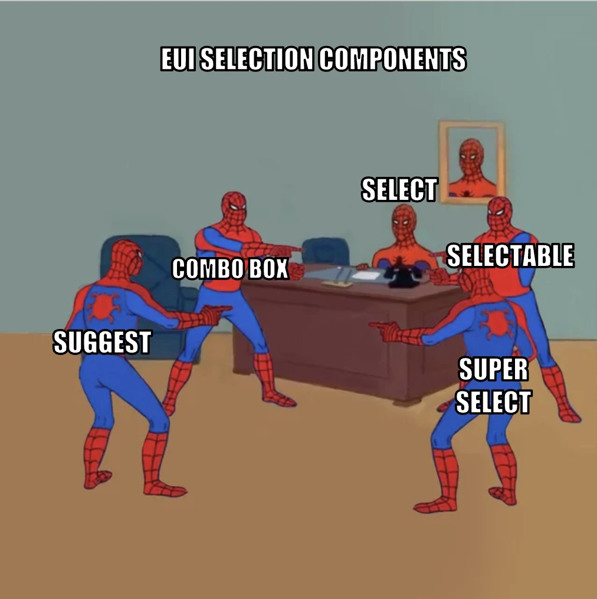

# The Ultimate Guide to EUI Selection Components

EUI offers different selection solutions and choosing the right one  may seem tricky. Welcome to a comprehensive guide on the EUI selection components. This guide will include explanations and comparisons for each component. 

## Meet the EUI selection components

EUI currently offers **5** different selection solutions. 

### [`EuiSelect`](https://elastic.github.io/eui/#/forms/form-controls#select)
`EuiSelect` renders a basic HTML `<select>` element. This is a no-frills selection component that renders `<options>` as a string. It should be used when you need to render 7 to 12 single items where only one option will be selected. If you would like to customize how the options are rendered and selected, you can use [`EuiSuperSelect`](#euisuperselect) instead. For  lists over 12 items, consider using [`EuiComboBox`](#euicombobox) which has search and multi-select capabilities. 

### [`EuiSuperSelect`](https://elastic.github.io/eui/#/forms/super-select)
`EuiSuperSelect` gives you more control over the display of the options in the dropdown. The `dropdownDisplay prop` gives you the ability to pass in full React nodes for each option, allowing for multi-line option text or option descriptions.

### [`EuiComboBox`](https://elastic.github.io/eui/#/forms/combo-box)
`EuiComboBox` allows multiple items to be selected and shown all at once. This should be used when the user has a number of options to choose from and needs to be able to search for them. `EuiComboBox` also allows users to specify a custom value in addition to selecting from a predetermined list.

### [`EuiSelectable`](https://elastic.github.io/eui/#/forms/selectable)
`EuiSelectable` renders a searchable list where multiple options can be selected or excluded. It should not be used for primary navigation, but can be used to simplify the construction of popover navigational menus. `EuiSelectable` does not appear in a popover or show all selected items in a list.
 
 #### [`EuiSelectableTemplateSitewide`](https://elastic.github.io/eui/#/templates/sitewide-search)
 `EuiSelectableTemplateSitewide` is an opinionated wrapper around `EuiSelectable`.  It creates the search input that triggers a popover containing a list of navigation options. Options many include a  display label, icon, avatar, and meta text.

### [`EuiSuggest`](https://elastic.github.io/eui/#/forms/suggest)
`EuiSuggest` is a text field used to display suggestions. The status of each suggestion is displays on its right side. Statuses include `saved`, `unsaved`,  `unchanged`, and `isLoading`. Include `type` and `label` in your list of suggestions to customize each option. 

## Comparing selection components

Below is a handy reference for comparing the selection components.

|   | `EuiSelect` | `EuiSuperSelect` | `EuiSelectable` | `EuiComboBox` | `EuiSuggest` |
|---|:---:|:---:|:---:|:---:|:---:|
| Select a single option  | ✅ | ✅ | ✅ | ✅ | ✅ |
| Select multiple options  | ❌ | ❌ | ✅ | ✅ | ❌ |
| Accepts custom values from users | ❌ | ❌ | ❌ | ✅  | ❌ |
| Option exclusion | ❌ | ❌ | ✅ | ❌ | ❌ |
| Customizable option display | ❌ | ✅ | ❌ | ✅ | ❌
| Controllable loading state | ✅ | ✅ | ✅ | ✅ | ✅ |
| Customizable loading state | ✅ | ✅ | ❌ | ✅ | ✅ |
| Customizable error handling | ❌ | ❌ | ✅ | ❌ | ❌ 
| Searchable | ❌ | ❌ | ✅ | ✅ | ❌ |
| Accepts custom values from users | ❌ | ❌ | ❌ | ✅ | ❌ |
| `disabled` state | ✅   (Disables whole component) | ✅   (Disables individual option) | ✅   (Disables individual option) | ✅   (Disables whole component) | ❌ |
| `readOnly` state | ❌ | ✅ | ❌ | ❌ | ❌ |
| Built in utility function for clearing user input | ❌ | ❌ | ✅ | ✅  | ✅ 

---

Still have a question? Feel free to comment below, reach out to us via our Slack channel (#eui), or open an issue. We're always happy to help!

