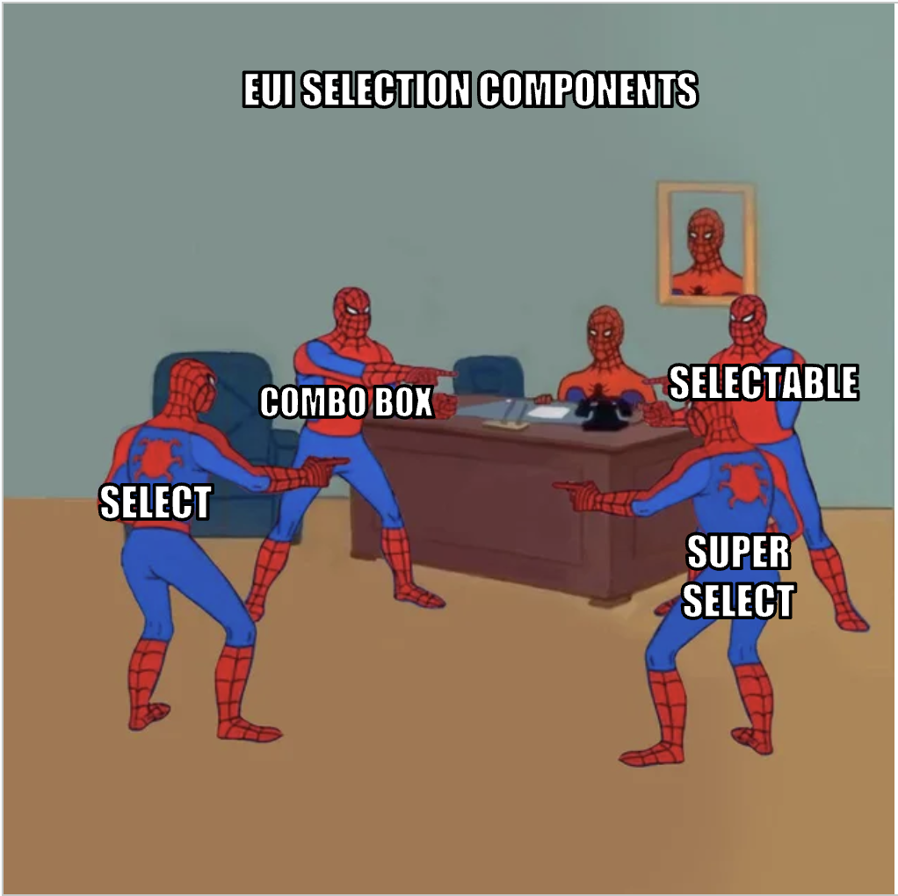

# The Ultimate Guide to EUI Selection Components

Welcome to a comprehensive guide on EUI's many selection components. Choosing the right one may seem tricky - this guide will help you decide which component to use and when, including explanations and comparisons for each component.

## Meet the EUI selection components

EUI currently offers **4** different selection solutions.

### [`EuiSelect`](https://elastic.github.io/eui/#/forms/form-controls#select)
`EuiSelect` renders a basic HTML `<select>` element. This is a no-frills selection component that renders `<options>` as a string. It should be used when you need to render 7 to 12 items where only one option will be selected.

In general, we strongly recommend reaching for `EuiSelect` first when possible over other more complex selection components. Native form controls tend to have better cross-browser and cross-device affordances (particularly for mobile devices), and are more familiar to end users due to their ubiquity across the internet.

If you need to customize how the options are rendered and selected, you can use [EuiSuperSelect](#euisuperselect) instead. For lists over 12 items, consider using EuiSelectable which has search and multi-select capabilities.

### [`EuiSuperSelect`](https://elastic.github.io/eui/#/forms/super-select)
`EuiSuperSelect` gives you more control over the display of the options in the dropdown. The `dropdownDisplay` prop gives you the ability to pass in custom React nodes for each option, allowing for multi-line option text or descriptions.

In general, we recommend reaching for `EuiSuperSelect` only if custom option display is absolutely necessary, as `EuiSelect` is natively more accessible.

### [`EuiComboBox`](https://elastic.github.io/eui/#/forms/combo-box)
`EuiComboBox` allows multiple items to be selected and shown in a horizontally-oriented pill list. It allows users to search through a list of dropdown options, and additionally supports custom user-generated input outside of the available options.

In general, for multi-select scenarios, we recommend using `EuiComboBox` over `EuiSelectable` only when custom user input is required, or when only selections should be immediately visible and unselected options should not.
 
### [`EuiSelectable`](https://elastic.github.io/eui/#/forms/selectable)
`EuiSelectable` renders a vertically-oriented list where multiple options can be selected or excluded. Doing so will render an icon next to the option that represents its selection state. It can optionally be rendered with a search box for filtering through many options, or as just a list for fewer options.

In general, we recommend using `EuiSelectable` for most multi-selection purposes. It is by far our most accessible and flexible selection component (although customization may require extra development). It can be used within popovers and flyouts, or as a standalone list.

 #### [`EuiSelectableTemplateSitewide`](https://elastic.github.io/eui/#/templates/sitewide-search)
 `EuiSelectableTemplateSitewide` is an opinionated wrapper around `EuiSelectable`` and is an example of the flexibility that `EuiSelectable` offers. It renders a search input that triggers a popover containing a list of navigation options. Options may include a display label, icon, avatar, and meta text.

In general, we only recommend its usage for a global search bar from an app-wide page header.

## Comparing selection components

Below is a handy reference for comparing the selection components.

|   | `EuiSelect` | `EuiSuperSelect` | `EuiSelectable` | `EuiComboBox` | 
|---|:---:|:---:|:---:|:---:|
| Select a single option | ✅ | ✅ | ✅ | ✅ | 
| Select multiple options | ❌ | ❌ | ✅ | ✅ | 
| Accepts custom values from user input | ❌ | ❌ | ❌ | ✅ | 
| Option exclusion | ❌ | ❌ | ✅ | ❌ |
| Customizable option display | ❌ | ✅ | ✅ | ✅ |
| Customizable loading/error messages | ❌ | ❌ | ✅ | ❌ |
| Searchable | ❌   (native select behavior will jump to options based on user typing)| ❌ | ✅ | ✅ |
| `disabled` state | ✅   (Disables whole component) | ✅   (Disables individual option) | ✅   (Disables individual option) | ✅   (Disables whole component) |
| `readOnly` state | ❌ | ✅ | ❌ | ❌ |
| Built in utility function for clearing user input | ❌ | ❌ | ✅   (Clears search input) | ✅   (Clears all selections) |
| Supports virtualization | ❌ | ❌ | ✅ | ✅ |

---

## Still have a question? ##
Feel free to comment below or [open an issue](https://github.com/elastic/eui/issues/new/choose). We're always happy to help!

